<a id="mulu">目录</a>
<a href="#mulu" class="back">回到目录</a>
<style>
    .back{width:40px;height:40px;display:inline-block;line-height:20px;font-size:20px;background-color:lightyellow;position: fixed;bottom:50px;right:50px;z-index:999;border:2px solid pink;opacity:0.3;transition:all 0.3s;color:green;}
    .back:hover{color:red;opacity:1}
    img{vertical-align:bottom;}
</style>

<!-- @import "[TOC]" {cmd="toc" depthFrom=3 depthTo=6 orderedList=false} -->

<!-- code_chunk_output -->

- [简介](#简介)
    - [基本介绍](#基本介绍)
    - [安装](#安装)
    - [一个简单的例子](#一个简单的例子)
- [模板语法](#模板语法)
- [数据绑定](#数据绑定)
- [el和data的两种写法](#el和data的两种写法)
- [MVVM模型](#mvvm模型)
- [数据代理](#数据代理)
    - [object.defineProperty](#objectdefineproperty)
    - [数据代理](#数据代理-1)
- [事件与methods属性](#事件与methods属性)
    - [基本形式](#基本形式)
    - [事件修饰符](#事件修饰符)
    - [键盘事件](#键盘事件)
- [计算属性computed](#计算属性computed)
- [监视属性watch](#监视属性watch)

<!-- /code_chunk_output -->

<!-- 打开侧边预览：f1->Markdown Preview Enhanced: open...
只有打开侧边预览时保存才自动更新目录 -->

写在前面：此笔记来自b站课程[尚硅谷Vue2.0+Vue3.0全套教程](https://www.bilibili.com/video/BV1Zy4y1K7SH) / [资料下载](https://www.aliyundrive.com/s/B8sDe5u56BU/folder/61138e6e8582eecbe4c84546a1b2d58363d20bc0)

### 简介
##### 基本介绍
**Vue**：一套用于**构建用户界面**的**渐进式**JS框架
- **构建用户界面**：即将数据渲染到页面上
- **渐进式**：Vue可以自底向上逐层的应用，比如最简单的应用只需一个轻量核心库，也可以引入各种Vue插件构建复制应用

**特点**：
- **组件化模型**：提高代码复用率和可维护性
  `.vue`格式文件：可以存储一个ui组件的HTML/JS/CSS代码
- **声明式编码**：无需直接操作DOM
  例如：根据已知数据拼接HTML代码
    {:width=150 height=150}
- **虚拟DOM**+**Diff算法**：尽量复用DOM节点
  比如原来有3个人的数据，就需要3个li来展示，当新增一个人时，原生JS就会重新构造4个li来渲染，即从数据直接构造**真实DOM(Real-DOM/True-DOM)**，而Vue在中间增加了一步**虚拟DOM(Virtual-DOM)**，它存储在内存中
  {:width=250 height=250}
  最后的结果：不变的节点无需重新构造。Diff算法就是用来比较哪些节点不变的
##### 安装
[Vue官网](https://cn.vuejs.org/)，最重要的是[api](https://cn.vuejs.org/api/)
**两种安装方式**：
- 直接用`<script>`引入CDN链接或本地下载的`vue.js`
- NPM+命令行

这里先介绍用script引入的方式，有两个不同的版本
- 开发版本：包含完整的警告和调试
- 生产版本：删除了警告，体积更小

```html
<script src="./js/vue.js"></script>
```
{:width=150 height=100}
在引入后，全局环境中就多了一个函数（或者说对象）`Vue`，类似于jq中的`$`
{:width=150 height=150}

---

下载Vue开发者工具`Vue devtools`
- edge：直接在扩展里面搜索`Vue.js devtools`，下载
- chrome：用网盘资料里的`05_其它`->`vue_dev_tools.crx`手动添加
    {:width=300 height=300}
    将crx文件直接拖到扩展程序界面中，就可弹出安装窗口

之后进入该扩展的设置界面，勾选`允许访问文件网址`/`允许访问文件URL`，可以发现引入`Vue.js`时弹出的要求安装devtools的警告没有了

---

如何彻底关闭使用开发版本的警告：
```html
<script>
    Vue.config.productionTip = false;
</script>
```
若无效，直接更改`Vue.js`，将上面那行代码加在js文件的最后
##### 一个简单的例子
- 准备好一个容器`#root>h1`
- 创建Vue实例`new Vue({})`，构造函数中应传入一个配置对象
  - `el`：指定当前Vue实例为哪个容器服务，值通常为CSS选择器字符串
  - `data`：一个对象/函数，存储和这个容器相关的数据，并且这些数据只能由这个容器使用。data的属性值可以是字符串等基本数据类型，也可以是一个对象
- 在容器中使用`data`：使用`{{属性名}}`语法（类似于Jinja这类模板引擎），容器里的代码被称为**Vue模板**

```html
<body>
    <div id="root">
        <h1>Hello, {{name}}</h1>
    </div>
</body>
<script>
    new Vue({
        el: "#root", //指定容器
        // el:document.getElementById("root") //也可以，但使用较少
        data: {
            name: "Vue"
        }
    });
</script>
```
{:width=50 height=50}
**一些问题**：
- vue实例和容器是**一一对应**的关系
  - 如果有两个容器，且都符合`el`中的选择器，但Vue只识别第一个，相当于`querySelector`而不是`querySelectorAll`
  - 如果创建多个Vue对象，它们都指向同一个容器，则第二个Vue对象会报错，且里面的data不能被容器使用
- 容器中`{{ }}`除了能写Vue实例中data的属性，还能写**JS表达式或代码**，例如`1+1`/`Date.now()`/`name.toUpperCase()`/三元表达式/if语段等

**Vue开发者工具的简单使用**：
f12打开控制台
{:width=150 height=150}
点击data里的属性值可以更改它们，之后模板中用到该数据的地方都会随之改变
**`Vue.js`和`Vue.min.js`的区别**：
Vue.js多了一些便于理解的警告，例如在创建Vue实例时没写`new`
- `Vue.js`：
  {:width=70 height=70}
- `Vue.min.js`：
  {:width=50 height=50}
### 模板语法
前面介绍的`{{ }}`称为**插值语法**，即在标签体内插入一个值
这里重点介绍**指令语法**：主要用于设置标签的属性
- 语法：`v-bind:属性名="JS表达式/代码"`/`:属性名="JS表达式/代码"`
- Vue中还有很多指令，形式都是`v-xxx`，此处只是拿`v-bind`举例子

```html
<body>
    <div id="root">
        <h1>我是插值语法{{text}}！</h1>
        <a v-bind:href="url.toUpperCase()" :style="css" :data-time="Date.now()">我是指令语法</a>
    </div>
</body>
<script>
    new Vue({
        el: "#root",
        data: {
            text: "abc",
            url: "http://www.baidu.com",
            css: "color:red"
        }
    });
</script>
```
{:width=100 height=100}
```html
<body>
    <div id="root">
        <h1>{{text}}</h1>
        <p :style="p.css">{{p.text}}</p>
    </div>
</body>
<script>
    new Vue({
        el: "#root",
        data: {
            text: "我是h1标签",
            p: {
                text: "我是p标签",
                css: "color:blue;"
            }
        }
    });
</script>
```
{:width=80 height=80}
### 数据绑定
例如一个文本输入框，想设置默认值，按照之前的写法`v-bind`：
```html
<div id="root">
    单向数据绑定：<input type="text" :value="name">
</div>
```
Vue实例中name的值作为默认值，当修改输入框中的值时，name的值不会变，这种称为**单向数据绑定**，即只能根据Vue-data改html页面中的值
现在想实现**双向数据绑定**：当修改输入框中的值时，name的值同步改变
- 语法：`v-model:属性名="JS表达式/代码"`/`v-model="JS表达式/代码"`
- 注意：只能用于表单类元素上（输入类元素），通常设置到它们的`value`属性上，所以可以省略属性名`value`

```html
<body>
    <div id="root">
        单向数据绑定：<input type="text" :value="name1">
        双向数据绑定：<input type="text" v-model:value="name2">
        <!-- 双向数据绑定也可以写成：<input type="text" v-model="name2"> -->
    </div>
</body>
<script>
    new Vue({
        el: "#root",
        data: {
            name1: "单向数据绑定",
            name2: "双向数据绑定"
        }
    });
</script>
```
{:width=250 height=250}
### el和data的两种写法
在之前的案例中，我们直接在Vue构造函数中指定了`el`和`data`
```js
const v = new Vue({});
console.log(v);
```
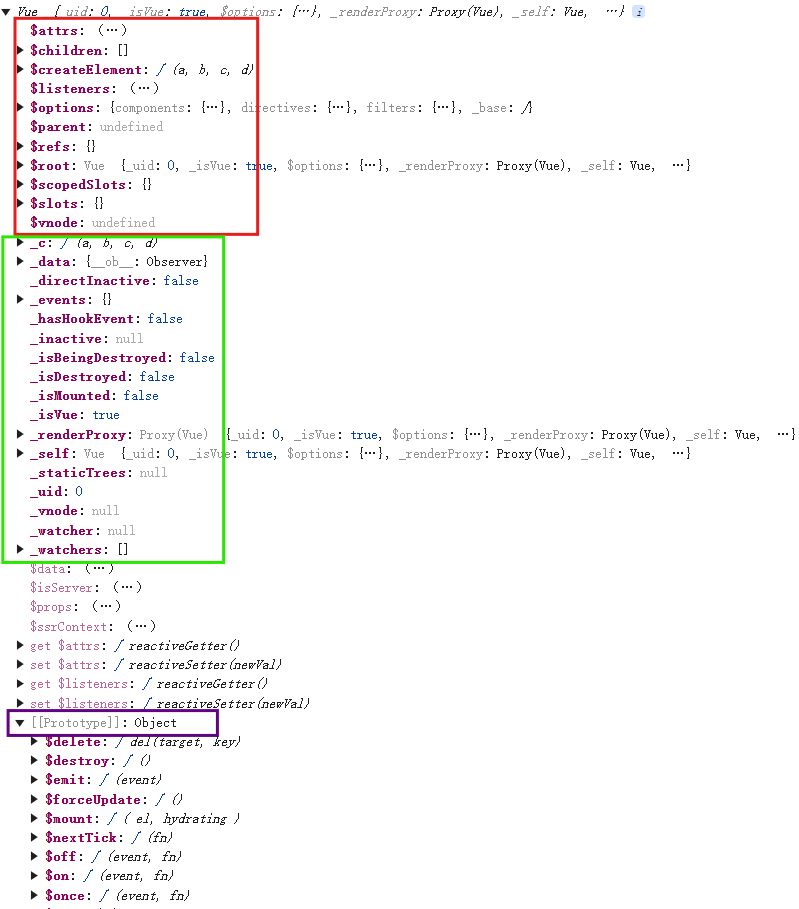{:width=500 height=500}
Vue实例对象的属性中，以`$`开头的是给人看的，以`_`开头的都是底层使用的
**el的第二种写法：**使用Vue实例对象的属性`v.$mount('#root')`
**data的第二种写法：**函数式，即传入一个函数，该函数返回数据。该函数必须是function声明的普通函数，不能是箭头函数
```html
<body>
    <div id="root">
        <h1>{{name}}</h1>
    </div>
</body>
<script>
    const v = new Vue({
        data: function () {
            console.log(this); //此处this是Vue实例对象
            return {
                name: 'abc'
            };
        }
    });
    v.$mount('#root');
</script>
```
注：`data: function () {}`还可以简写成`data() {}`
一个重要的原则：由Vue管理的函数，一定不能写箭头函数，否则this就不是Vue实例了
例：1s后再填充`{{name}}`内容
```js
const v = new Vue({
    data() {
        return {
            name: 'abc'
        };
    }
});
setTimeout(() => {
    v.$mount('#root');
}, 1000);
```
### MVVM模型
- M：模型(model)，对应data中的数据
- V：视图(view)，即Vue中的模板，或者说它渲染出的DOM页面
- VM：视图模型(view model)，Vue实例对象，之后我们统一都用`vm`来指代创建出的Vue实例对象
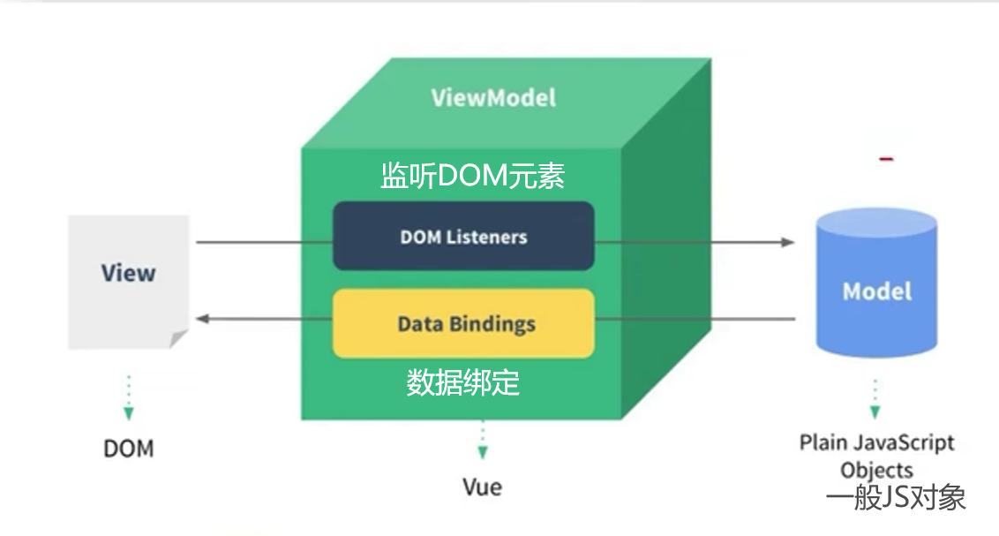{:width=300 height=300}
映射到实际代码中：
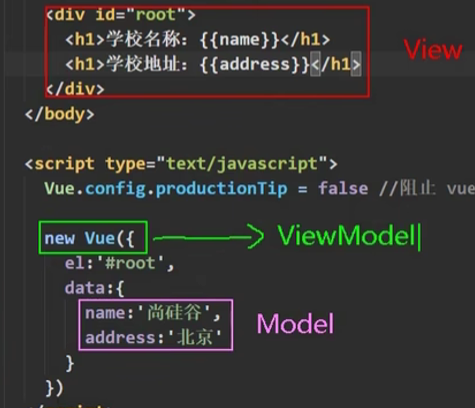{:width=300 height=300}
在`{{ }}`中，除了data中的属性，还可以是vm上任一属性，例如`$options`/`$emit`等
**总结**：
- data中的所有属性，其实都是绑定到了vm上
- vm上的所有属性，以及Vue原型上的所有属性，在Vue模板中都可以直接使用
### 数据代理
##### object.defineProperty
该方法用于为某个对象增加属性
```js
object.defineProperty(对象, 新增的属性名,{
    value: 新增的属性值,
    enumerable: true, //控制新增的属性是否可枚举（可遍历），默认为false
    writable: true, //控制新增的属性是否可被修改，默认为false
    configurable: true, //控制新增的属性是否可被删除，默认为false
})
```
```js
let p1 = {
    name: 'abc',
    sex: 'male'
};
let p2 = {
    name: 'abc',
    sex: 'male'
};
Object.defineProperty(p1, 'age', {
    value: 18,
});
Object.defineProperty(p2, 'age', {
    value: 18,
    enumerable: true
});
console.log(p1, p2);
for (let i in p1) {
    console.log(i + ":" + p1[i]);
}
for (let i in p2) {
    console.log(i + ":" + p2[i]);
}
```
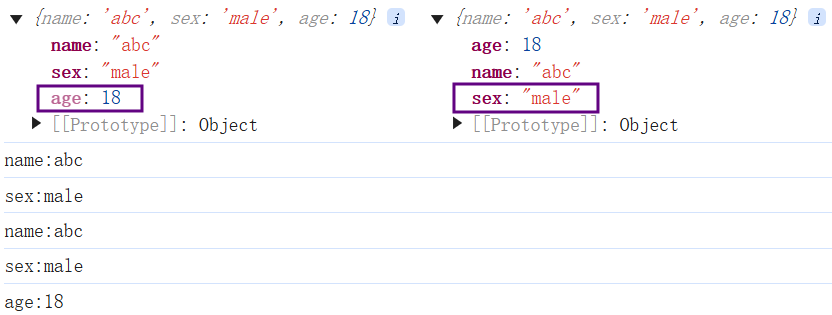{:width=300 height=300}
可以看到p1的age属性颜色较淡，说明该属性是不可枚举的，而p2就是正常的颜色

---

除此之外，该方法还可以使用某个变量作为属性值，例如使用`number`作为`age`的值，当`number`改变时`age`的属性值也跟着改变
```js
object.defineProperty(对象, 新增的属性名,{
    get: function(){ //当有人读取该属性时，这个函数就会被调用，返回值即为属性值
        return 属性值
    },
    set: function(value){ //当有人修改该属性时，这个函数就会被调用
        /* value即为修改后的新属性值 */
    }
})
```
一般我们把`get: function(){}`和`set: function(){}`称为`getter`和`setter`，可简写成`get(){}`/`set(){}`
```js
let p = {
    name: 'abc',
    sex: 'male'
};
let number = 18;
Object.defineProperty(p, 'age', {
    get: function () {
        console.log('getter被调用');
        return number;
    }
});
console.log(p);
```
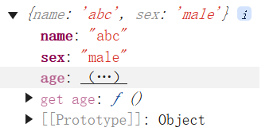{:width=120 height=120}
点击一下`(...)`，就可以得到age的属性值
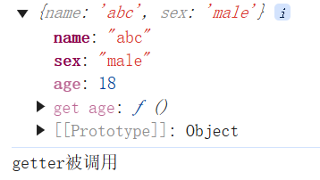{:width=150 height=150}
**例：getter和setter结合实现双向绑定，即修改`number`时`age`改变，修改`age`时`number`也改变**
```js
    let p = {
        name: 'abc',
        sex: 'male'
    };
    let number = 18;
    Object.defineProperty(p, 'age', {
        get() {
            console.log('getter被调用');
            return number;
        },
        set(value) {
            console.log('setter被调用');
            number = value;
        }
    });
    setTimeout(() => {
        number = 19;
        console.log("修改了number，age属性值为" + p.age);
    }, 1000);
    setTimeout(() => {
        p.age = 20;
        console.log("修改了age，number为" + number);
    }, 2000);
```
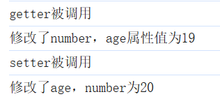{:width=100 height=100}
##### 数据代理
数据代理：通过一个对象代理对另一个对象中属性的操作（读/写）
例：通过`obj2`代理`obj`的属性操作
```js
let obj = { x: 1 };
let obj2 = { y: 2 };
Object.defineProperty(obj2, 'x', {
    get() {
        return obj.x;
    },
    set(v) {
        obj.x = v;
    }
});
```
Vue中的数据代理：
```js
const vm = new Vue({
    el: "#root",
    data: {
        name: 'abc',
        age: 18
    }
});
console.log(vm);
```
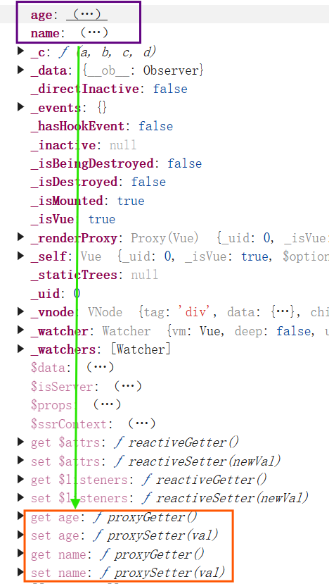{:width=500 height=500}
观察到vm中的name和age都是`(...)`状态，说明它们应各有一个setter和getter。又根据name和age是在data中声明并赋值，说明`vm中name和age`实际上是`data中name和age`的代理。在vm中，`data中name和age`存储在`vm._data`中
```js
const vue_data = {
    name: 'abc',
    age: 18
}
const vm = new Vue({
    el: "#root",
    data: vue_data
});
console.log(vm._data === vue_data); //true
vm.name = 'bcd';
console.log(vm._data.name); //此时页面中{{name}}也同步改变
```
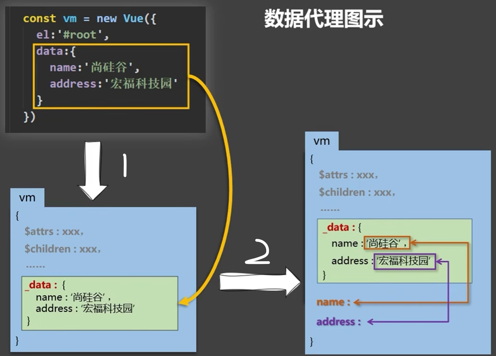{:width=400 height=400}
- 在第一步中，只是把`new Vue`中的data赋值到`vm._data`中，没有数据代理，还没有`vm.name`。如果要在标签中使用name，只能写成`{{_data.name}}`
- 在第二步中，通过getter和setter将`vm._data.name`映射到`vm.name`（使用`object.defineProperty`方法），这就是数据代理，简化了标签中name的写法

**总结**：
- Vue通过**vm对象**来代理**vm.data对象**中属性的操作
- **好处**：更方便的操作data中的数据
- **原理**：
  - 使用`object.defineProperty`把data中所有属性添加到vm上
  - 为每个添加的属性指定一个getter/setter
  - 在getter/setter内操作data中对应的属性

补充：如果直接`console.log(vm)`，点开`_data`
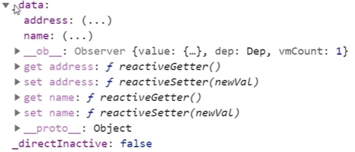{:width=200 height=200}
又可以看到`(...)`，而不是`name:'abc'`，但这不是数据代理，而是数据劫持，目的是实现`_data.name`改变引起`{{name}}`的变化（响应式），后面会详细讲
### 事件与methods属性
##### 基本形式
`v-on:事件名`/`@事件名`，以点击事件`click`为例
```html
<div v-on:click="函数名"></div>
<!-- 或者 -->
<div @click="函数名"></div>
<script>
    const vm = new Vue({
        el: "#root",
        methods:{
            函数名(e){} //e是事件对象
        }
    });
</script>
```
注：写在双引号中的变量均会被识别为Vue实例对象中的属性，如果想要实现`@click="alert(111)"`的效果，就要写成
```html
<div @click="window.alert(111)" id="root"></div>
<script>
    const vm = new Vue({
        el: "#root",
        data: {
            window
        }
    });
</script>
```
**例**：
```html
<body>
    <div id="root">
        <h1 v-on:click="show_info">{{name}}</h1>
    </div>
</body>
<script>
    const vm = new Vue({
        el: "#root",
        data: {
            name: 'abc'
        },
        methods: {
            show_info(e) {
                console.log(this); //this是vm
                console.log(e); //e是事件对象
                console.log(e.target); //点击的DOM对象
                console.log(e.target.innerText); //文本 
            }
        }
    });
</script>
```
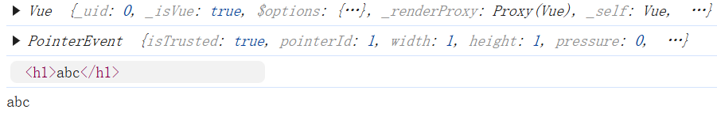{:width=100 height=100}

---

如何向事件函数中传入参数
```html
<div v-on:click="函数名(参数, $event)"></div>
<!-- 或者 -->
<div @click="函数名(参数, $event)"></div>
<script>
    const vm = new Vue({
        el: "#root",
        methods:{
            函数名(参数, e){} //e是事件对象
        }
    });
</script>
```
例：
```html
<body>
    <div id="root">
        <h1 v-on:click="show_info($event, 18, 'abc')">{{name}}</h1>
    </div>
</body>
<script>
    const vm = new Vue({
        el: "#root",
        data: {
            name: 'abc'
        },
        methods: {
            show_info(e, age, name) {
                console.log(e, age, name);
            }
        }
    });
</script>   
```
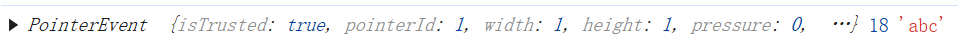{:width=30 height=30}
注：
- `函数名(参数, $event)`中`$event`和参数的顺序可以自由指定，它与methods里面的`函数名(参数, e){}`顺序对应
- methods里面的函数不做数据代理，因为函数是写死的，而数据是可变的
- 函数其实也可以写到data中，但因为data中的属性要做数据代理，消耗性能较多
##### 事件修饰符
`@事件名.事件修饰符`，事件修饰符包括：
- `prevent`（常用）：阻止默认事件
- `stop`（常用）：阻止事件冒泡
- `once`（常用）：让该事件只触发一次
- `capture`：使用事件的捕获模式（让事件在捕获阶段触发）
- `self`：只有`e.target`是当前操作的元素时才触发
- `passive`：立即指向事件默认行为，不等待事件回调执行
    注：`self`也可以阻止冒泡，只不过`prevent`是加在要触发事件的元素上，`self`是加在其它不想触发事件的元素上

如果想要写多个事件修饰符，就直接`@事件名.事件修饰符1.事件修饰符2...`（修饰符可以连续写）
**例1：阻止冒泡和默认事件**
- 不使用事件修饰符
    ```html
    <body>
        <div id="root" @click="click">
            <a href="xxx" @click="click">我是a标签</a>
        </div>
    </body>
    <script>
        const vm = new Vue({
            el: "#root",
            methods: {
                click(e) {
                    e.stopPropagation(); //阻止冒泡
                    e.preventDefault(); //阻止默认事件
                    alert("点击了a");
                }
            }
        });
    </script>
    ```
- 使用事件修饰符
    ```html
    <body>
        <div id="root" @click="click">
            <a href="xxx" @click.prevent.stop="click">我是a标签</a>
        </div>
    </body>
    <script>
        const vm = new Vue({
            el: "#root",
            methods: {
                click(e) {
                    alert("点击了a");
                }
            }
        });
    </script>
    ```
例2：`passive`
```html
<body>
    <ul id="root" @wheel="wheel">
        <li></li>
        <li></li>
        <li></li>
        <li></li>
    </ul>
</body>
<script>
    const vm = new Vue({
        el: "#root",
        methods: {
            wheel(e) {
                for (let i = 1; i < 10000; i++)
                    console.log(1);
            }
        }
    });
</script>
```
此时滚动滚轮，发现会等到计数完成后，滚动条才滚动。如果使用`@wheel.passive`，就不存在这个问题。常常在移动端中使用该修饰符
注意：`wheel`是鼠标滚轮滚动时触发（不管页面元素实际有没有动），`scroll`是页面元素滚动时触发（不管是通过鼠标滚轮还是拖动滚动条）
##### 键盘事件
`keydown`和`keyup`
当事件对象为指定键时触发：`@键盘事件名.按键别名`，常用的按键别名：
- `enter`回车
- `delete`删除/退格
- `esc`ESC
- `space`空格
- `tab`TAB
- `up`上
- `down`下
- `left`左
- `right`右

同时按下多个键：`@键盘事件名.按键别名1.按键别名2...`，例如`@keyup.ctrl.y`就是同时按下CTRL+y
如果指定键没有按键别名：`@键盘事件名.按键的key值`，按键的key值可使用`e.key`获取，但注意：JS中自带的一些key值和Vue中的key值不同，比如大小写切换，`e.key`是`CapsLock`，但Vue中是`capsLock`或`caps-lock`
不是键盘上的所有键都能绑定事件：一些特殊按键（如调音量、亮度）就可能不被识别
例：
```html
<body>
    <div id="root">
        <input type="text" @keyup.tab="keyup" placeholder="请输入：">
    </div>
</body>
<script>
    const vm = new Vue({
        el: "#root",
        methods: {
            keyup(e) {
                console.log(`按下了tab键`);
            }
        }
    });
</script>
```
但按下tab时并没有输出内容，这是因为tab键有一个特性——让输入框失去焦点，由于上面设置的是`keyup`按键抬起时触发，而按下tab键时就已经失焦，所以不会触发
解决方法：使用`@keydown.tab`，tab键必须使用keydown
类似的特殊按键：CTRL、alt、shift、win(meta)
- `keyup`：按下它们的同时，再按下其它按键，随后释放其它键，才被触发
- `keydown`：正常触发

补充：
- 也可以通过`@键盘事件名.按键的keycode值`方法绑定，但不推荐使用（因为keycode可能不被最新浏览器支持，不同键盘的keycode值可能不同）
- `Vue.config.keyCodes.自定义键名 = keycode`：定制按键别名
    ```html
    <body>
        <div id="root">
            <input type="text" @keydown.huiche="keydown" placeholder="请输入：">
        </div>
    </body>
    <script>
        Vue.config.keyCodes.huiche = 13;
        const vm = new Vue({
            el: "#root",
            methods: {
                keydown(e) {
                    console.log(`按下了回车键`);
                }
            }
        });
    </script>
    ```
### 计算属性computed
在Vue中，**属性(Property)**指`data`中的键值对。计算属性就是拿属性进行计算，得到一个新的属性，存储在`computed`中
```js
new Vue({
    data: {
        属性1: "",
        属性2: ""
    },
    computed:{
        计算属性:{
            get(){ //当有人读取该计算属性是，get函数就会被调用，返回值即为计算属性值
                this.属性1; //使用data中的属性
                return 值;
            },
            set(v){ //不必须写，当计算属性被修改时调用
                console.log(v); //v为修改后的新值
            }
        }
    }
});
```
- 计算属性不在`vm._data`中，但可使用`{{计算属性}}`插值语法调用
- **get什么时候调用**：
  - 初次读取计算属性时，如果有多个计算属性插值，也只调用一次get，采用了缓存机制
  - 所依赖的数据发生变化时调用
    注意：
    - 当计算属性被修改时，调用set，但如果其所依赖的数据未被修改，就不调用get，`{{计算属性}}`不会更新
    - 所依赖的数据指的是Vue实例对象中的data，不能是外部作用域中的变量。如果计算属性中用到了外部变量，即使外部变量改变，也不会调用get

**计算属性的简写形式**：只读不改（只有get）
```js
new Vue({
    computed:{
        // 计算属性:function(){ //或者直接写成↓
        计算属性(){
            return 值;
        }
    }
});
```
**例1：两个输入框分别输入姓/名，全名在下面显示，姓截取输入的前3位**
- 插值语法：
    ```html
    <body>
        <div id="root">
            姓：<input type="text" v-model="firstname"><br>
            名：<input type="text" v-model="lastname"><br>
            姓名：<span>{{firstname.slice(0, 3)}}·{{lastname}}</span>
        </div>
    </body>
    <script>
        new Vue({
            el: "#root",
            data: {
                firstname: "",
                lastname: ""
            }
        });
    </script>
    ```
- methods：
    ```html
    <body>
        <div id="root">
            姓：<input type="text" v-model="firstname"><br>
            名：<input type="text" v-model="lastname"><br>
            姓名：<span>{{merge()}}</span>
        </div>
    </body>
    <script>
        new Vue({
            el: "#root",
            data: {
                firstname: "",
                lastname: ""
            },
            methods: {
                merge() {
                    const first = this.firstname.slice(0, 3);
                    const last = this.lastname;
                    return `${first}·${last}`;
                }
            }
        });
    </script>
    ```
    对于这两种方法，只要输入框中的值发生改变，Vue就会重新解析模板，对使用`data`/`merge`的所有地方重新渲染，没有缓存机制
- 计算属性：
    ```html
    <body>
        <div id="root">
            姓：<input type="text" v-model="firstname"><br>
            名：<input type="text" v-model="lastname"><br>
            姓名：<span>{{fullname}}</span>
        </div>
    </body>
    <script>
        const vm = new Vue({
            el: "#root",
            data: {
                firstname: "",
                lastname: ""
            },
            computed: {
                fullname: {
                    get() {
                        const first = this.firstname.slice(0, 3);
                        const last = this.lastname;
                        return `${first}·${last}`;
                    },
                    set(v) {
                        const name_list = v.split('·');
                        this.firstname = name_list[0].slice(0, 3);
                        this.lastname = name_list[1];
                    }
                }
            }
        });
    </script>
    ```
    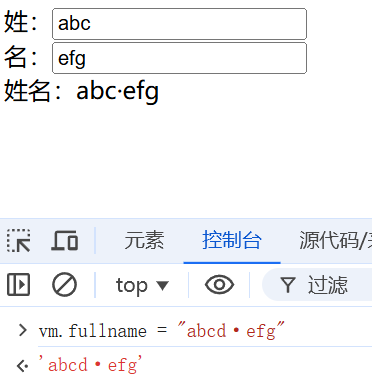{:width=300 height=300}
    简写形式：
    ```js
        const vm = new Vue({
        el: "#root",
        data: {
            firstname: "",
            lastname: ""
        },
        computed: {
            fullname: function () {
                const first = this.firstname.slice(0, 3);
                const last = this.lastname;
                return `${first}·${last}`;
            }
        }
    });
    ```
    但这样就无法改变fullname值
**例2：有两种天气（热/冷），点击按钮切换**
- 第一种写法：按钮绑定点击事件，并使用methods
    ```html
    <body>
        <div id="root">
            <h2>今天天气为{{weather}}</h2>
            <button @click="change_weather">切换天气</button>
        </div>
    </body>
    <script>
        const vm = new Vue({
            el: "#root",
            data: {
                is_hot: true
            },
            computed: {
                weather() {
                    return this.is_hot ? "热" : "冷";
                }
            },
            methods: {
                change_weather() {
                    this.is_hot = !this.is_hot;
                }
            }
        });
    </script>
    ```
- 第二种写法：按钮绑定点击事件，不使用methods（将处理函数直接写到事件里面
    ```html
    <body>
        <div id="root">
            <h2>今天天气为{{weather}}</h2>
            <button @click="is_hot = !is_hot;">切换天气</button>
        </div>
    </body>
    <script>
        const vm = new Vue({
            el: "#root",
            data: {
                is_hot: true
            },
            computed: {
                weather() {
                    return this.is_hot ? "热" : "冷";
                }
            }
        });
    </script>
    ```
### 监视属性watch
用于监视某个属性的改变
```js
/* 第一种方法 */
const vm = new Vue({
    watch:{
        要监视的属性:{
            handler(newVal, oldVal){ //当要监视的属性发生改变时触发
                console.log(oldVal); //修改前的值
                console.log(newVal); //修改后的值
            },
            immediate:true, //初始化时让handler调用一次，默认为false
        }
    }
});
/* 第二种方法 */
vm.$watch('要监视的属性', {
    handler(newVal, oldVal){},
    immediate:true
});
```
- 计算属性也可以被监视
- 初始化时handler中`oldVal`为undefined
- 要监视的属性必须存在，但如果不存在也不会报错，只是`oldVal`和`newVal`均为undefined
