<a id="mulu">目录</a>
<a href="#mulu" class="back">回到目录</a>
<style>
    .back{width:40px;height:40px;display:inline-block;line-height:20px;font-size:20px;background-color:lightyellow;position: fixed;bottom:50px;right:50px;z-index:999;border:2px solid pink;opacity:0.3;transition:all 0.3s;color:green;}
    .back:hover{color:red;opacity:1}
    img{vertical-align:bottom;}
</style>

<!-- @import "[TOC]" {cmd="toc" depthFrom=3 depthTo=6 orderedList=false} -->

<!-- code_chunk_output -->

- [简介](#简介)
    - [基本介绍](#基本介绍)
    - [安装](#安装)
    - [一个简单的例子](#一个简单的例子)
- [模板语法](#模板语法)
- [数据绑定](#数据绑定)

<!-- /code_chunk_output -->

<!-- 打开侧边预览：f1->Markdown Preview Enhanced: open...
只有打开侧边预览时保存才自动更新目录 -->

写在前面：此笔记来自b站课程[尚硅谷Vue2.0+Vue3.0全套教程](https://www.bilibili.com/video/BV1Zy4y1K7SH) / [资料下载](https://www.aliyundrive.com/s/B8sDe5u56BU/folder/61138e6e8582eecbe4c84546a1b2d58363d20bc0)

### 简介
##### 基本介绍
**Vue**：一套用于**构建用户界面**的**渐进式**JS框架
- **构建用户界面**：即将数据渲染到页面上
- **渐进式**：Vue可以自底向上逐层的应用，比如最简单的应用只需一个轻量核心库，也可以引入各种Vue插件构建复制应用

**特点**：
- **组件化模型**：提高代码复用率和可维护性
  `.vue`格式文件：可以存储一个ui组件的HTML/JS/CSS代码
- **声明式编码**：无需直接操作DOM
  例如：根据已知数据拼接HTML代码
    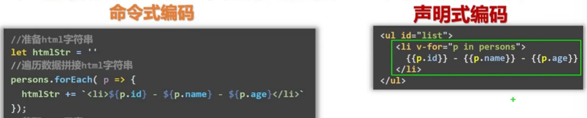{:width=150 height=150}
- **虚拟DOM**+**Diff算法**：尽量复用DOM节点
  比如原来有3个人的数据，就需要3个li来展示，当新增一个人时，原生JS就会重新构造4个li来渲染，即从数据直接构造**真实DOM(Real-DOM/True-DOM)**，而Vue在中间增加了一步**虚拟DOM(Virtual-DOM)**，它存储在内存中
  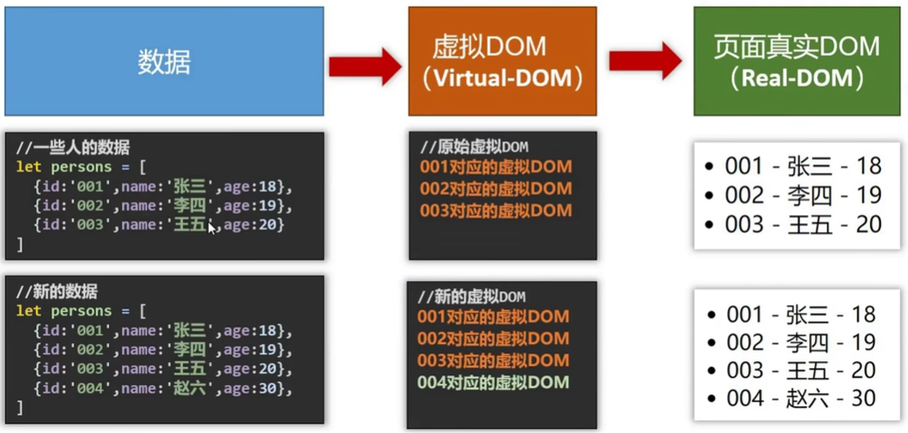{:width=250 height=250}
  最后的结果：不变的节点无需重新构造。Diff算法就是用来比较哪些节点不变的
##### 安装
[Vue官网](https://cn.vuejs.org/)，最重要的是[api](https://cn.vuejs.org/api/)
**两种安装方式**：
- 直接用`<script>`引入CDN链接或本地下载的`vue.js`
- NPM+命令行

这里先介绍用script引入的方式，有两个不同的版本
- 开发版本：包含完整的警告和调试
- 生产版本：删除了警告，体积更小

```html
<script src="./js/vue.js"></script>
```
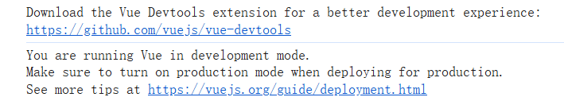{:width=150 height=100}
在引入后，全局环境中就多了一个函数（或者说对象）`Vue`，类似于jq中的`$`
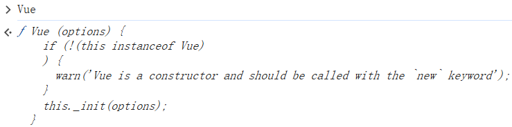{:width=150 height=150}

---

下载Vue开发者工具`Vue devtools`
- edge：直接在扩展里面搜索`Vue.js devtools`，下载
- chrome：用网盘资料里的`05_其它`->`vue_dev_tools.crx`手动添加
    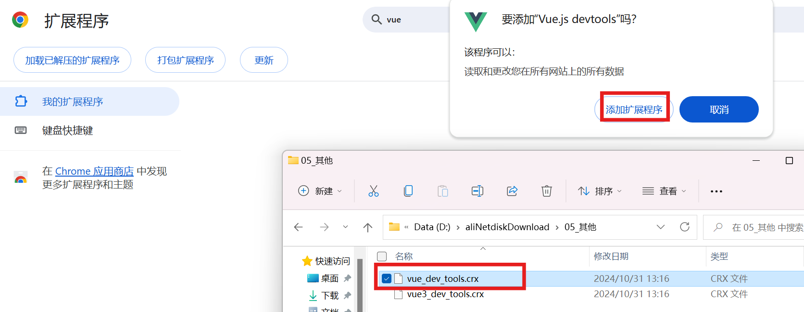{:width=300 height=300}
    将crx文件直接拖到扩展程序界面中，就可弹出安装窗口

之后进入该扩展的设置界面，勾选`允许访问文件网址`/`允许访问文件URL`，可以发现引入`Vue.js`时弹出的要求安装devtools的警告没有了

---

如何彻底关闭使用开发版本的警告：
```html
<script>
    Vue.config.productionTip = false;
</script>
```
若无效，直接更改`Vue.js`，将上面那行代码加在js文件的最后
##### 一个简单的例子
- 准备好一个容器`#root>h1`
- 创建Vue示例`new Vue({})`，构造函数中应传入一个配置对象
  - `el`：指定当前Vue示例为哪个容器服务，值通常为CSS选择器字符串
  - `data`：一个对象/函数，存储和这个容器相关的数据，并且这些数据只能由这个容器使用。data的属性值可以是字符串等基本数据类型，也可以是一个对象
- 在容器中使用`data`：使用`{{属性名}}`语法（类似于Jinja这类模板引擎），容器里的代码被称为**Vue模板**

```html
<body>
    <div id="root">
        <h1>Hello, {{name}}</h1>
    </div>
</body>
<script>
    new Vue({
        el: "#root", //指定容器
        // el:document.getElementById("root") //也可以，但使用较少
        data: {
            name: "Vue"
        }
    });
</script>
```
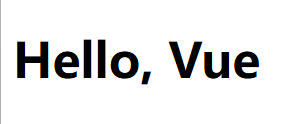{:width=50 height=50}
**一些问题**：
- vue实例和容器是**一一对应**的关系
  - 如果有两个容器，且都符合`el`中的选择器，但Vue只识别第一个，相当于`querySelector`而不是`querySelectorAll`
  - 如果创建多个Vue对象，它们都指向同一个容器，则第二个Vue对象会报错，且里面的data不能被容器使用
- 容器中`{{ }}`除了能写Vue示例中data的属性，还能写**JS表达式或代码**，例如`1+1`/`Date.now()`/`name.toUpperCase()`/三元表达式/if语段等

**Vue开发者工具的简单使用**：
f12打开控制台
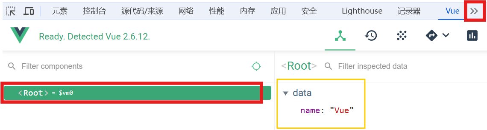{:width=150 height=150}
点击data里的属性值可以更改它们，之后模板中用到该数据的地方都会随之改变
**`Vue.js`和`Vue.min.js`的区别**：
Vue.js多了一些便于理解的警告，例如在创建Vue示例时没写`new`
- `Vue.js`：
  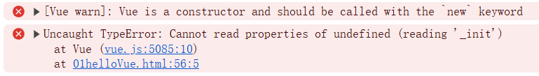{:width=70 height=70}
- `Vue.min.js`：
  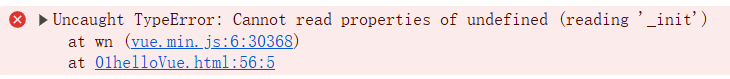{:width=50 height=50}
### 模板语法
前面介绍的`{{ }}`称为**插值语法**，即在标签体内插入一个值
这里重点介绍**指令语法**：主要用于设置标签的属性
- 语法：`v-bind:属性名="JS表达式/代码"`/`:属性名="JS表达式/代码"`
- Vue中还有很多指令，形式都是`v-xxx`，此处只是拿`v-bind`举例子

```html
<body>
    <div id="root">
        <h1>我是插值语法{{text}}！</h1>
        <a v-bind:href="url.toUpperCase()" :style="css" :data-time="Date.now()">我是指令语法</a>
    </div>
</body>
<script>
    new Vue({
        el: "#root",
        data: {
            text: "abc",
            url: "http://www.baidu.com",
            css: "color:red"
        }
    });
</script>
```
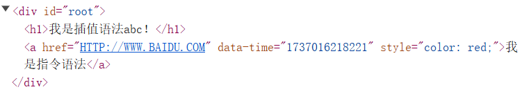{:width=100 height=100}
```html
<body>
    <div id="root">
        <h1>{{text}}</h1>
        <p :style="p.css">{{p.text}}</p>
    </div>
</body>
<script>
    new Vue({
        el: "#root",
        data: {
            text: "我是h1标签",
            p: {
                text: "我是p标签",
                css: "color:blue;"
            }
        }
    });
</script>
```
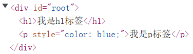{:width=80 height=80}
### 数据绑定
例如一个文本输入框，想设置默认值，按照之前的写法`v-bind`：
```html
<div id="root">
    单向数据绑定：<input type="text" :value="name">
</div>
```
Vue示例中name的值作为默认值，当修改输入框中的值时，name的值不会变，这种称为**单向数据绑定**，即只能根据Vue-data改html页面中的值
现在想实现**双向数据绑定**：当修改输入框中的值时，name的值同步改变
- 语法：`v-model:属性名="JS表达式/代码"`/`v-model="JS表达式/代码"`
- 注意：只能用于表单类元素上（输入类元素），通常设置到它们的`value`属性上，所以可以省略属性名`value`

```html
<body>
    <div id="root">
        单向数据绑定：<input type="text" :value="name1">
        双向数据绑定：<input type="text" v-model:value="name2">
        <!-- 双向数据绑定也可以写成：<input type="text" v-model="name2"> -->
    </div>
</body>
<script>
    new Vue({
        el: "#root",
        data: {
            name1: "单向数据绑定",
            name2: "双向数据绑定"
        }
    });
</script>
```
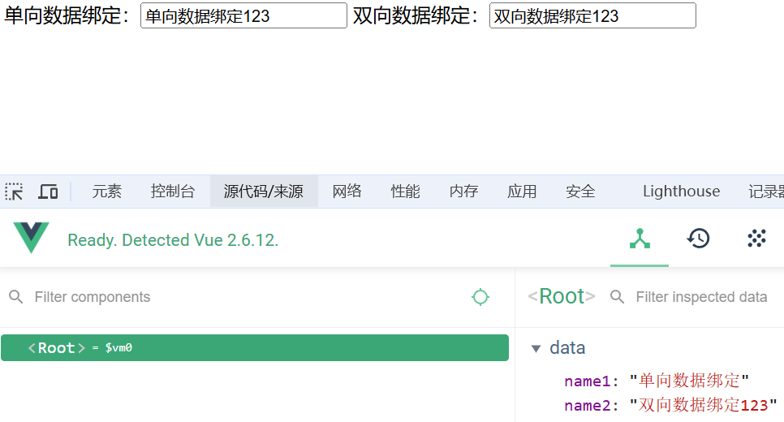{:width=250 height=250}
