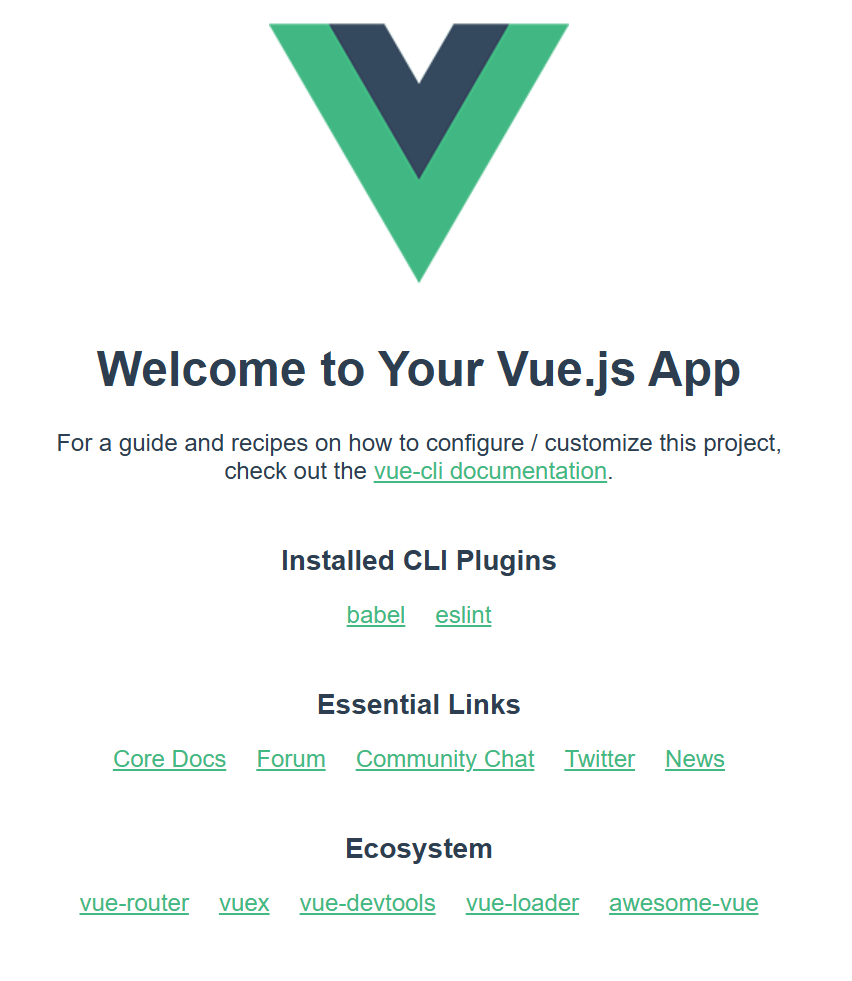
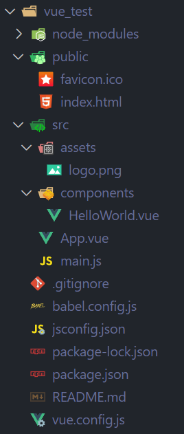
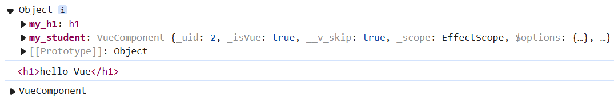
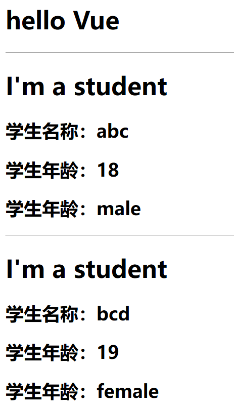

<a id="mulu">目录</a>
<a href="#mulu" class="back">回到目录</a>
<style>
    .back{width:40px;height:40px;display:inline-block;line-height:20px;font-size:20px;background-color:lightyellow;position: fixed;bottom:50px;right:50px;z-index:999;border:2px solid pink;opacity:0.3;transition:all 0.3s;color:green;}
    .back:hover{color:red;opacity:1}
    img{vertical-align:bottom;}
</style>

<!-- @import "[TOC]" {cmd="toc" depthFrom=3 depthTo=6 orderedList=false} -->

<!-- code_chunk_output -->

- [VueCLI简介](#vuecli简介)
    - [结构](#结构)
    - [render函数](#render函数)
    - [默认配置](#默认配置)
    - [ref属性](#ref属性)
    - [props配置](#props配置)
    - [mixin混入](#mixin混入)
    - [plugins插件](#plugins插件)
    - [scoped样式](#scoped样式)

<!-- /code_chunk_output -->

<!-- 打开侧边预览：f1->Markdown Preview Enhanced: open...
只有打开侧边预览时保存才自动更新目录 -->

写在前面：此笔记来自b站课程[尚硅谷Vue2.0+Vue3.0全套教程](https://www.bilibili.com/video/BV1Zy4y1K7SH) / [资料下载](https://www.aliyundrive.com/s/B8sDe5u56BU/folder/61138e6e8582eecbe4c84546a1b2d58363d20bc0)

### VueCLI简介
**Vue脚手架(Vue command line interface, Vue CLI)**：Vue官方提供的标准化开发工具（开发平台）
[Vue CLI官网](https://cli.vuejs.org/zh)
**安装**：
- 全局安装：`npm install -g @vue/cli`
- 在想要创建项目的目录下：`vue create 项目名`，会出现一个选项框选择用哪个Vue版本，选择`[Vue 2] babel, eslint`
- 进入项目目录中：`cd 项目名`
- 启动项目：`npm run serve`
- 最后进入`App running at`的网址就可以了

{:width=300 height=300}
##### 结构
{:width=500 height=500}
- `babel.config.js`：Babel控制文件，将ES6转为ES5，通常不需要手动写
- `package.json`/`package-lock.json`：包版本说明文件，提供三个命令
  - `serve`：开发时使用
  - `build`：完成所有代码，将整个工程变成浏览器可识别的HTML/css/js文件
  - `lint`：对所有js和vue文件进行语法检查（很少使用）
- `src`
  - `main.js`：整个项目的入口文件
    执行`npm run serve`后，首先执行的就是它
    ```js
    import Vue from 'vue' //引入Vue包
    import App from './App.vue' //引入App组件（所有组件的父组件）
    Vue.config.productionTip = false //关闭生产提示
    new Vue({ //创建Vue实例对象vm
         render: h => h(App), //将App组件放入容器中
    }).$mount('#app') //指定容器，也可以直接写到vm配置项el中
    ```
  - `App.vue`：App组件
  - `assets`：静态资源（logo图、视频等）
  - `components`：自己写出来的子组件
- `public`：包括网页图标`favicon.ico`和`index.html`
  ```html
  <head>
    <meta charset="utf-8">
    <!-- 针对IE浏览器的一个特殊配置，让IE以最高的渲染级别渲染页面 -->
    <meta http-equiv="X-UA-Compatible" content="IE=edge">
    <!-- 开启移动端的理想视口 -->
    <meta name="viewport" content="width=device-width,initial-scale=1.0">
    <!-- 网页图标（BASE_URL指public文件夹） -->
    <link rel="icon" href="<%= BASE_URL %>favicon.ico">
    <!-- 网页标题（就是项目名） -->
    <title><%= htmlWebpackPlugin.options.title %></title>
  </head>
  <body>
    <!-- 如果浏览器不支持js，该段内容就会展示在页面上 -->
    <noscript>
      <strong>We're sorry but <%= htmlWebpackPlugin.options.title %> doesn't work properly without JavaScript enabled. Please enable it to continue.</strong>
    </noscript>
    <!-- 容器 -->
    <div id="app"></div>
  </body>
  ```

补充：CLI要求所有子组件都必须是多个单词，且使用大驼峰`MyStudent`命名
##### render函数
```js
/* 这是VueCLI自带的main.js */
new Vue({
    render: h => h(App),
}).$mount('#app');
/* 如果改成下面这样，会报错 */
new Vue({
  el:'#app',
  template:`<App></App>`,
  components:{App}
});
```
两个解决方法：
- 引入完整版的Vue包（默认引入的Vue包没有模板解析器的功能，不能使用template配置项）
  将`import Vue from 'vue'`改为`import Vue from 'vue/dist/vue'`
- 使用render函数（VueCLI默认使用的方法）：`render: h => h(App)`

render的完整写法：
```js
render(createElement){ //createElement是一个用于创建标签的函数
  return createElement(标签名, 标签文本内容); //createElement('h1', "我是h1标签")
  //或者直接传入组件：createElement(组件名)
}
```
为什么默认使用精简版Vue包`vue.runtime.xxx.js`，而不是完整版`vue.js`：
- 模板解析器占了整个vue体积的1/3
- 项目写完后用webpack打包，此时模板解析器就没有用了，如果用的是完整版，打包后的文件仍包含模板解析器
  因此精简版的Vue可以节省体积
##### 默认配置
Vue脚手架隐藏了所有webpack相关的配置，如果想查看具体配置，需执行命令`vue inspect > output.js`，这会将配置对象写入`output.js`中，但这个文件是只读的，无法修改（或者说即使修改这个文件也不会对配置产生影响）
如果不修改配置文件，脚手架中哪些文件不能改：`public`中的图标和`index.html`、`src`文件夹、`main.js`
方法：在`package.json`同层文件夹中（即项目的最外层）创建一个新的文件`vue.config.js`，把想修改的配置写在里面，在webpack执行时，会把这个文件中的配置与默认配置进行合并
[具体的配置项](https://cli.vuejs.org/zh/config)

例：
```js
module.exports = {
  //修改入口文件
  pages: {
    index: {
      entry: 'src/index/main.js',
    }
  },
  //关闭语法检查（例如出现没有使用的变量会报错）
  lintOnSave: false
}
```
注意：
- 修改配置后，必须重启`npm run serve`
- `vue.config.js`中不要传入空对象，例如`pages:{index: {}}`，这样会把默认配置覆盖掉，使配置缺失
##### ref属性
用来给元素或子组件注册引用信息（替代原生js中document.queryselector）
- 应用在html标签上获取的是真实DOM元素，应用在组件标签上是组件实例对象vc

```html
<h1 ref="xxx"></h1>
<School ref="xxx"></School>
<script>
    export default {
      methods:{
        func(){
          this.$refs.xxx;
        }
      }
    }
</script>
```
例：
```html
<!-- App.vue -->
<template>
<div>
    <h1 ref="my_h1">{{msg}}</h1>
    <MyStudent ref="my_student"/>
    <button @click="showDOM">showDOM</button>
</div>
</template>
<script>
    import MyStudent from './components/MyStudent.vue';
    export default {
        name:"App",
        components:{
            MyStudent
        },
        data() {
            return {
                msg:"hello Vue",
            }
        },
        methods: {
            showDOM(){
                console.log(this.$refs);    
                console.log(this.$refs.my_h1); 
                console.log(this.$refs.my_student); 
            }
        },
    }
</script>
```
{:width=100 height=100}
##### props配置
用于向组件中传入参数
```html
<!-- App.vue（使用组件的地方） -->
<School 参数名n="参数值n" ></School>
<!-- School.vue（声明组件的地方） -->
{{参数名n}} <!-- 参数就相当于data中的变量，使用方法相同 -->
<script>
    export default {
      data(){return{}}, //data中不能出现传入的参数
      /* 第一种接收方法：简单接收（最常用） */
      props:['参数名1', '参数名2', ...], //顺序不非得相同
      /* 第二种接收方法：限制参数类型 */
      props:{
        参数名1: 类型(String/Number等),
        参数名2: 类型,
        ... //如果传来的数据不符合，控制台会输出警告（但不报错，且仍按传来数据原本的类型进行处理）
      },
      /* 第三种接收方法：对参数进行更多的限制 */
      props:{
        参数名1(){
          type: 类型(String/Number等), //限制参数类型
          required: true, //该参数是否必要（是否必须传入该参数），默认为false
          default: 默认值 //设置参数默认值
        },
        ... //一般情况下，required和default不同时出现
      },
    }
</script>
```
例：
```html
<!-- App.vue -->
 <template>
<div>
    <h1>{{msg}}</h1>
    <hr>
    <MyStudent name="abc" age="18" sex="male"/>
    <hr>
    <MyStudent name="bcd" age="19" sex="female"/>
</div>
</template>
<script>
    import MyStudent from './components/MyStudent.vue';
    export default {
        name:"App",
        components:{
            MyStudent
        },
        data() {
            return {
                msg:"hello Vue",
            }
        },
    }
</script>
<!-- MySchool.vue -->
<template>
    <div class="student">
        <h1>{{msg}}</h1>
        <h2>学生名称：{{name}}</h2>
        <h2>学生年龄：{{age}}</h2>
        <h2>学生年龄：{{sex}}</h2>
    </div>
</template>
<script>
    export default {
        name:"MyStudent",
        data() {
            return {
                msg:"I'm a student"
            };
        },
        props:['name', 'age', 'sex']
    }
</script>
```
{:width=300 height=300}
一个问题：如果想让传入的age+1后展示，不能直接`{{age+1}}`（因为传入的age一定是字符串类型）
- 方法1：student组件中`{{age*1+1}}`
- 方法2：传入参数时使用动态绑定`<Student :age="18"/>`，因为`v-bind`会把引号里面的内容当成表达式（`18`这个表达式表示一个数字）

例：
```html
<!-- App.vue -->
<MyStudent name="abc" :age="19"/>
<MyStudent name="bcd" sex="female"/>
<!-- MySchool.vue -->
<template>
    <div class="student">
        <h2>学生名称：{{name}}</h2>
        <h2>学生年龄：{{age+1}}</h2>
        <h2>学生年龄：{{sex}}</h2>
    </div>
</template>
<script>
    export default {
        name:"MyStudent",
        props:{
            name:{
                type:String,
                required:true
            },
            age:{
                type:Number,
                default:18
            },
            sex:{
                type:String,
                default:'male'
            }
        }
    }
</script>
```
**补充**：
- 如果props中声明了没传入的变量，这个声明变量的值为undefined
- 传入变量名不能是Vue中的关键字（如`key`等）
- props的优先级比data高：如果子组件中在data里声明了一个和传入变量同名的变量，最后实际展示的是传入的那个变量值
- props接收的变量不能改（可以改，但可能出现未知错误）
  可以在data里声明另一个同值变量，最后修改这个变量即可
  例如想改传入的age变量：
  ```html
  <template>
    <h2>学生年龄：{{my_age}}</h2>
  </template>
  <script>
      export default {
          name:"MyStudent",
          data() {
              return {
                  my_age: this.age //将age复制给my_age
              };
          },
          props:['age'],
          methods:{
            change_age(){
              this.my_age++; //改新变量
            }
          }
      }
  </script>
  ```
##### mixin混入
即多个组件共享一个vc配置项
将配置项写入一个js中：
```js
/* xxx.js */
export const 变量名 = {
  配置项 //可以是多个任意配置项（包括生命周期等）
}
/* 组件.vue的<script>标签中 */
import {变量名} from xxx.js
export default {
    mixins:[变量名]
}
```
例：给组件添加方法`show_name`
```js
/* mixin.js */
export const show_name = {
    methods: {
        show_name() {
            alert(this.name);
        },
        mounted() {
            console.log("mounted");
        }
    }
}
export const create_data = {
    data() {
        return { x: 1 };
    }
}
```
```html
<!-- MySchool.vue -->
<template>
    <div class="school">
        <h2 @click="show_name">学校名称：{{name}}</h2>
        <h2>学校地址：{{addr}}</h2>
    </div>
</template>
<script>
    import {show_name, create_data} from '../mixin'; //可以有选择地引入
    export default {
        name:"MyStudent",
        data() {
            return {
                name:"ABC",
                addr:'x-x-x'
            };
        },
        mixins:[show_name, create_data]
    }
</script>
```
引入后，原有的data/方法等不会被覆盖，而是在此基础上新增
- 对于data/方法等，如果组件中原有的和引入的同名，以组件中原有的为准
- 对于生命周期钩子，两个叠加，都执行，且先执行引入的

---

全局配置mixin：给每个组件（包括vm和所有的vc）都进行配置
```js
/* main.js */
import {变量名} from xxx.js
Vue.mixin(变量名) //可以多次调用以引入多个mixin配置
```
##### plugins插件
作用是增强Vue的功能，通常定义在与`main.js`同级的`plugins.js`中
```js
/* plugins.js */
export default {
    install(Vue){ //接收Vue作为参数
        //可以给Vue绑定各种方法（例如全局过滤器、全局指令、全局混入）
        //也可以给Vue原型上添加方法（vm和vc就都能用了）
    }
}
/* main.js */
import plugins from './plugins';
Vue.use(plugins); //可以多次调用以引入多个插件
```
例：
```js
/* plugins.js */
export default {
    install(Vue) {
        Vue.filter('my_slice', function (v) { //全局过滤器
            return v.slice(0, 4);
        });
        Vue.prototype.hello = () => { //添加方法
            alert('hello Vue');
        };
    }
}
/* main.js */
import plugins from './plugins';
Vue.use(plugins);
```
```html
<!-- MySchool.vue -->
<template>
    <div class="school">
        <h2>学校名称：{{name | my_slice}}</h2>
        <h2 @click="say_hello">学校地址：{{addr}}</h2>
    </div>
</template>
<script>
    export default {
        name:"MyStudent",
        data() {
            return {
                name:"ABCafdaadf",
                addr:'x-x-x'
            };
        },
        methods: {
            say_hello(){
                this.hello();
            }
        },
    }
</script>
```

---

在use时，还可以给插件传入参数
```js
/* plugins.js */
export default {
    install(Vue, x, y, z) {
        console.log(x, y, z); //1, 2, 3
    }
}
/* main.js */
import plugins from './plugins';
Vue.use(plugins, 1, 2, 3);
```
##### scoped样式
如果两个组件中都用了同一个CSS选择器指定同个样式，就会出现覆盖（根据import的顺序，后面的覆盖前面的）
方法：在组件中给style标签添加`scoped`属性，这可以让样式在局部生效，防止冲突
```html
<style scoped>
    /* CSS选择器 */
</style>
```
Vue在解析时会给组件最外层的div加上一个特殊的类名，并通过该类名进行选择
注意：通常不在App.vue的style中加scoped，因为在这写的CSS往往要给所有组件使用

---

补充：组件中style标签的lang属性——指定css语言（比如less或scss）
```html
<style lang="less" scoped>
    /* less选择器 */
    .demo{
        background-color: pink;
        .font{
            font-size: 40px;
        }
    }
</style>
```
但这需要安装`less-loader`包：`npm i less-loader`
