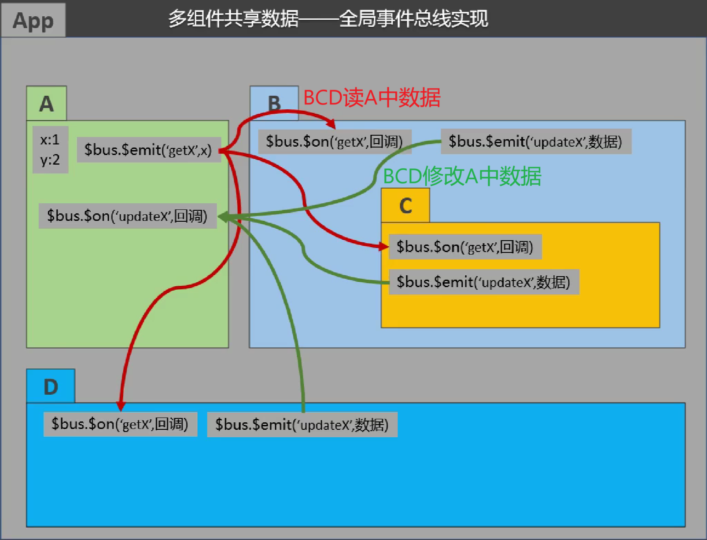
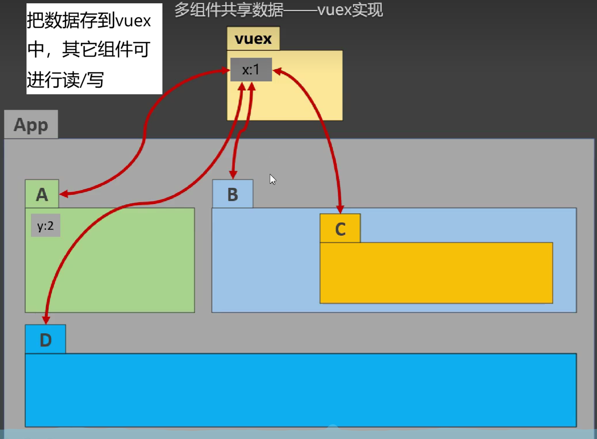
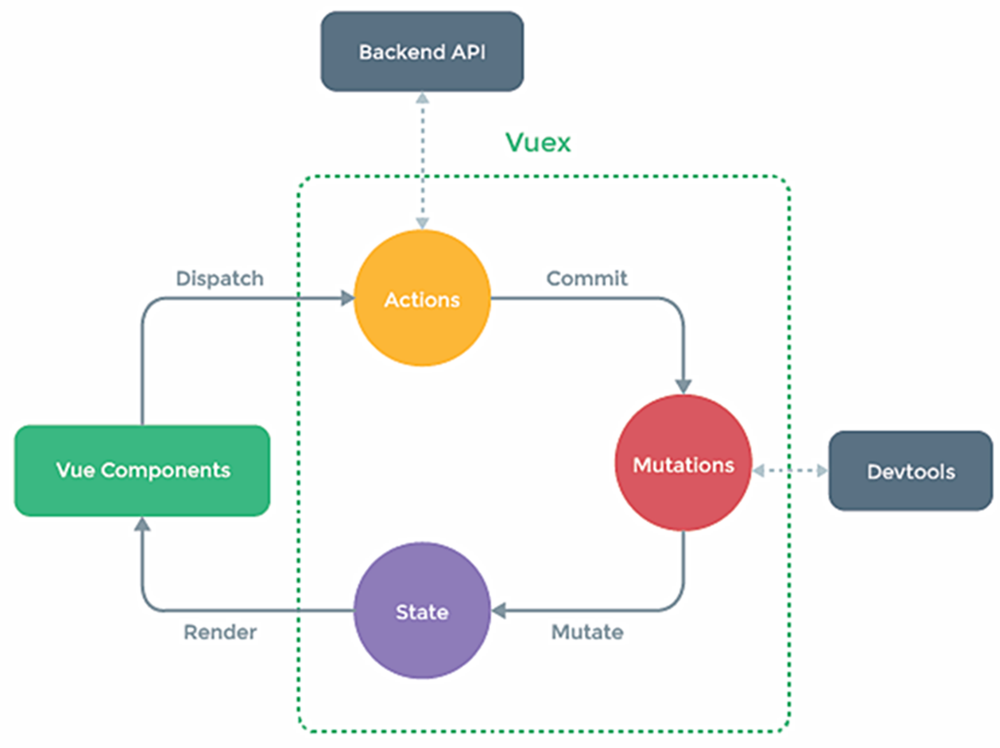

<a id="mulu">目录</a>
<a href="#mulu" class="back">回到目录</a>
<style>
    .back{width:40px;height:40px;display:inline-block;line-height:20px;font-size:20px;background-color:lightyellow;position: fixed;bottom:50px;right:50px;z-index:999;border:2px solid pink;opacity:0.3;transition:all 0.3s;color:green;}
    .back:hover{color:red;opacity:1}
    img{vertical-align:bottom;}
</style>

<!-- @import "[TOC]" {cmd="toc" depthFrom=3 depthTo=6 orderedList=false} -->

<!-- code_chunk_output -->

- [Vuex](#vuex)
    - [简介](#简介)
    - [基本使用](#基本使用)

<!-- /code_chunk_output -->

<!-- 打开侧边预览：f1->Markdown Preview Enhanced: open...
只有打开侧边预览时保存才自动更新目录 -->

写在前面：此笔记来自b站课程[尚硅谷Vue2.0+Vue3.0全套教程](https://www.bilibili.com/video/BV1Zy4y1K7SH) / [资料下载](https://www.aliyundrive.com/s/B8sDe5u56BU/folder/61138e6e8582eecbe4c84546a1b2d58363d20bc0)

### Vuex
##### 简介
专门在Vue中实现集中式状态（数据）管理的**Vue插件**，对Vue应用中多个组件的共享状态进行集中式的管理（读/写），也是一种组件间通信的方式，且适用于任意组件间通信
**多个组件需要共享数据：通过全局事件总线和vuex**
{:width=500 height=500}
{:width=500 height=500}
**什么时候用Vuex**：共享状态
- 多个组件依赖于同一状态（数据）
- 来自不同组件的行为需要变更同一状态（简单来说就是多个组件都想修改同个数据）

---

**工作原理**：
{:width=400 height=400}
- Vuex由3个部分组成，是绿框里面的`actions`/`mutations`/`state`
  - state对象中存储着数据
  - actions对象中存储一些操作数据的函数方法，格式：`{方法名:function(){}}`
  - mutations对象的格式与actions相同，不同的是，mutations里面的函数可以获得state中存储的数据和传来的新数据
- **具体过程**：
  - `Vue components`指组件，组件可以调用`dispatch(方法, 数据)`这个API来调用actions中的方法改变数据
  - actions中的方法内部调用`commit(方法, 数据)`
  - 数据传给mutations进行最终的修改，保存在state中
  - 重新渲染组件
- **actions的作用（为什么要有dispatch和commit，而不是直接传到mutations中）**：因为有时传给mutations的数据是由后端指定的，在修改前，需要先向后端发送请求获得数据，actions正是发送Ajax请求的地方。除此之外，如果想进行数据的判断/预加工，也是写在这里
  - vuex也提供了在`Vue components`中直接调用commit的功能，适用于不用发送请求、不用额外判断的情况
- 一个比喻：`Vue components`-来吃饭的客人，`store`-饭店、`actions`-服务员，`mutations`-后厨，`state`-做出来的菜
- 图中没有体现的是，Vuex这几个部分都由一个`store`统一管理
##### 基本使用
- 安装：vuex的3.x.x版本适用于Vue2，4.x.x版本适用于Vue3
  - 这里因为是Vue2，所以`npm i vuex@3`
- 在`src`文件夹下创建一个`store`文件夹，里面创建一个`index.js`，用于创建vuex中的store
    ```js
    import vuex from 'vuex'; //引入vuex
    import Vue from 'vue'; //引入vue
    Vue.use(vuex); //使用插件
    const actions = { //actions--用于响应组件中的动作
        方法名(context, value){ //context是上下文对象，value是组件调用时传来的数据
            context.state.数据名 //处理函数
            context.commit(mutations方法名, value); //调用commit
        },
    };
    const mutations = { //mutations--用于操作数据
        方法名(state, value){ //state是存储数据的那个state对象，value就是commit传来的值
            state.数据名 //处理函数
    };
    const state = {
        要存储的数据名: 值,
    }; //state--用于存储数据
    export default new vuex.Store({ //创建并暴露store
        actions,
        mutations,
        state
    });
    ```
    在开发中，actions中的方法名常小写，mutations中大写
- 在`main.js`中引入
    ```js
    import store from './store'; //引入store
    new Vue({
        render: h => h(App),
        store //使用store创建vm
    }).$mount('#app')
    ```
    注意：es6中会无视书写顺序，优先执行import，之后再执行其它语句。而`store/index.js`中`new vuex.Store`需要先执行`Vue.use(vuex)`，如果把它写到`main.js`中就会先执行`import store/index.js`，报错所以要在`store/index.js`中先使用vuex插件
- 在组件中使用
    ```js
    vc.$store.state.数据名 //读取vuex中的数据
    vc.$store.dispatch('action中的方法名', 数据); //调用dispatch修改vuex中的数据
    vc.$store.commit('mutations中的方法名', 数据); //调用commit修改vuex中的数据
    ```

例：下拉框选择每次加减的数量，点击`+`加，点击`-`减，`当前和为奇数再加`先判断当前求和是否为奇数，`等一等再加`延时0.5s再加
{:width=100 height=100}
- 普通Vue：
    ```html
    <div>
        <h1>当前求和为：{{count}}</h1>
        <select v-model.number="num">
            <option value="1">1</option>
            <option value="2">2</option>
            <option value="3">3</option>
        </select>
        <button @click="increment">+</button>
        <button @click="decrement">-</button>
        <button @click="incrementOdd">当前和为奇数再加</button>
        <button @click="incrementWait">等一等再加</button>
    </div>
    <script>
    export default {
        name: "MyCount",
        data() {
            return {
                count: 0,
                num: 1
            }
        },
        methods: {
            increment(){
                this.count += this.num;
            },
            decrement(){
                this.count -= this.num;
            },
            incrementOdd(){
                if(this.count%2){
                    this.count += this.num;
                }
            },
            incrementWait(){
                setTimeout(()=>{
                    this.count += this.num;
                }, 500);
            }
        },
    }
    </script>
    ```
    需要注意的是，下拉框要确保里面的是数字型，可以在每个option标签内的value前加冒号`:value="1"`，也可以在select标签内`v-model.number="num"`
- vuex：把`count`存到state中，`increment`系列的处理需要在actions中判断奇数和写延时器，`decrement`直接调commit（因为没有Ajax和判断）
    ```html
    <!-- MyCount.vue -->
    <div>
        <h1>当前求和为：{{$store.state.count}}</h1>
        <select v-model.number="num">
            <option value="1">1</option>
            <option value="2">2</option>
            <option value="3">3</option>
        </select>
        <button @click="increment">+</button>
        <button @click="decrement">-</button>
        <button @click="incrementOdd">当前和为奇数再加</button>
        <button @click="incrementWait">等一等再加</button>
    </div>
    <script>
    export default {
        name: "MyCount",
        data() {
            return {
                num: 1
            }
        },
        methods: {
            increment(){
                this.$store.commit('ADD', this.num);
            },
            decrement(){
                this.$store.commit('MINUS', this.num);
            },
            incrementOdd(){
                this.$store.dispatch('addOdd', this.num);
            },
            incrementWait(){
                this.$store.dispatch('addWait', this.num);
            }
        },
    }
    </script>
    ```
    ```js
    /* index.js */
    import vuex from 'vuex';
    import Vue from 'vue';
    Vue.use(vuex);
    const actions = {
        addOdd(context, value) {
            if (context.state.count % 2) {
                context.commit('ADD', value);
            }
        },
        addWait(context, value) {
            setTimeout(() => {
                context.commit('ADD', value);
            }, 500);
        },
    };
    const mutations = {
        ADD(state, value) {
            state.count += value;
        },
        MINUS(state, value) {
            state.count -= value;
        }
    };
    const state = {
        count: 0
    };
    export default new vuex.Store({ actions, mutations, state });
    ```

