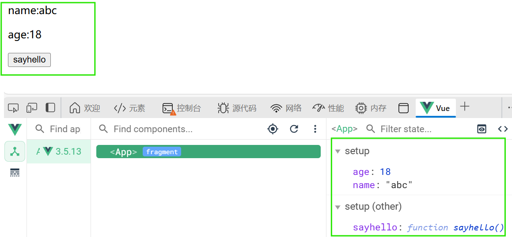
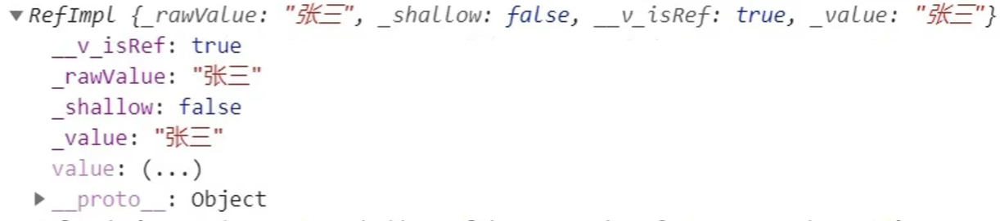
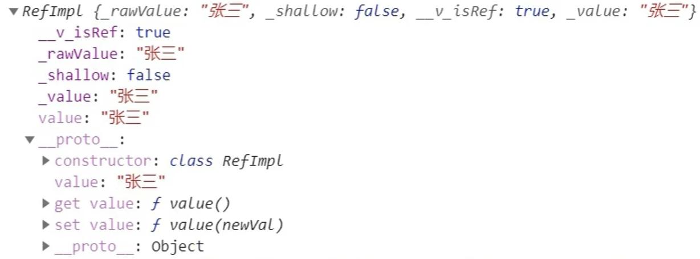

<a id="mulu">目录</a>
<a href="#mulu" class="back">回到目录</a>
<style>
    .back{width:40px;height:40px;display:inline-block;line-height:20px;font-size:20px;background-color:lightyellow;position: fixed;bottom:50px;right:50px;z-index:999;border:2px solid pink;opacity:0.3;transition:all 0.3s;color:green;}
    .back:hover{color:red;opacity:1}
    img{vertical-align:bottom;}
</style>

<!-- @import "[TOC]" {cmd="toc" depthFrom=3 depthTo=6 orderedList=false} -->

<!-- code_chunk_output -->

- [简介](#简介)
- [Composition api](#composition-api)
    - [setup](#setup)
    - [ref函数](#ref函数)

<!-- /code_chunk_output -->

<!-- 打开侧边预览：f1->Markdown Preview Enhanced: open...
只有打开侧边预览时保存才自动更新目录 -->

写在前面：此笔记来自b站课程[尚硅谷Vue2.0+Vue3.0全套教程](https://www.bilibili.com/video/BV1Zy4y1K7SH) / [资料下载](https://www.aliyundrive.com/s/B8sDe5u56BU/folder/61138e6e8582eecbe4c84546a1b2d58363d20bc0)

### 简介
**比Vue2的优势**：
- **性能提升**：打包大小更小、渲染更快、内存占用更少
- **源码升级**：使用Proxy代替defineProperty实现响应式，重写虚拟DOM的实现和Tree-Shaking
- **更好地支持TS**
- **一些新的特性**

---

两种创建方式：vue-cli和vite
**vue-cli**：同Vue2的创建方式，选择Vue3即可
**vite**：新一代前端构建工具
- 优势：传统方法都是先把各个模块打包完成后再启动，vite是先启动服务器，再根据HTTP请求申请模块
  - 开发环境中，无需打包操作，可快速的冷启动
  - 轻量快速的热重载(HMR)
  - 真正的按需编译，不再等待整个应用编译完成
- 方法：
  - 创建工程：`npm init vite-app <project-name>`
  - 进入工程目录：`cd <project-name>`
  - 安装依赖：`npm install`
  - 运行：`npm run dev`

---

**工程结构**：
- `src/main.js`：
    ```js
    import { createApp } from 'vue' //引入createApp工厂函数，而不是Vue构造函数
    import App from './App.vue'
    const app = createApp(App) //创建应用实例对象app，类似于vm，但更“轻”
    app.mount('#app') //挂载
    ```
    `app.unmount('#app')`卸载，调用后页面上不显示内容
- `src/App.vue`：唯一区别是组件模板结构可以没有根标签
    ```html
    <template>
    
    <HelloWorld msg="Welcome to Your Vue.js App"/>
    </template>
    ```
- 其它地方没有变化

---

**安装开发者工具**：搜索`Vue.js devtools`，edge上的同时支持Vue2/3，chrome上的找到logo右下角有`beta`标志的
### Composition api
Composition api：组合式API
##### setup
是Vue3中一个新的配置项，值为一个函数
- 组件中所有的数据、方法等均要配置在setup中，是所有组合式API“表演的舞台”
- 两种返回值：
  - （常用）若返回一个对象，则对象中的属性、方法，在模板中均可以直接使用
  - （了解）若返回一个渲染函数，则可以自定义渲染内容
- 注意：
  - 尽量不要与Vue2配置混用
    - Vue2配置(data/methos/computed...)中可以使用`this.属性`访问到setup中的属性、方法，但setup不能访问到Vue2配置
    - 如果有重名，setup优先
  - setup不能是一个async函数，因为返回值不再是return的对象，而是promise，模板看不到return对象中的属性（如果需要返回一个Promise，需要Suspense和异步组件的配合）

**返回一个对象**（常用）：
```html
<template>
  <p>name:{{name}}</p>
  <p>age:{{age}}</p>
  <button @click="sayhello">sayhello</button>
</template>
<script>
export default {
  name: 'App',
  setup() { //此处仅作演示，未考虑响应式
    let name = 'abc';
    let age = 18;
    function sayhello(){
      alert(`name:${name}, age:${age}`);
    }
    return {name, age, sayhello};
  }
}
</script>
```
{:width=300 height=300}
**返回一个渲染函数**：就是Vue2中的render函数
```html
<script>
import {h} from 'vue'
export default {
  name: 'App',
  setup() {
    return ()=>h('h1', '返回一个渲染函数');
  }
}
</script>
```
此时页面上只有`<h1>返回一个渲染函数</h1>`
##### ref函数
不是写在标签中的ref属性，ref属性仍然可用
在setup函数中，如果只是用`let a=1`的方式声明，则不会响应式，需要用ref函数处理
```js
import {ref} from 'vue'
export default {
  setup() {
    let 属性名 = ref(属性值); //声明
    function 方法名(){
      属性名.value = 新属性值 //修改属性
    }
    return {属性名};
  }
}
```
- 在标签中仍使用`{{属性名}}`读取属性值，不用加`.value`
- 属性值也可以是一个对象，在setup中仍使用`对象.value.属性名`

```html
<template>
  <p>name:{{name}}</p>
  <p>age:{{age}}</p>
  <p>job:{{job.name}} {{job.salary}}</p>
  <button @click="change">change</button>
</template>
<script>
import {ref} from 'vue'
export default {
  name: 'App',
  setup() {
    let name = ref('abc');
    let age = ref(18);
    let job = ref({
      name:'ABC',
      salary: 10000
    });
    function change(){
      age.value ++;
      job.value.salary = job.value.salary * 2 ;
    }
    return {name, age, job, change};
  }
}
</script>
```
如果ref函数中传入的是一个基本类型的数据，则返回一个`RefImpl`(reference implement)实例对象（引用实现的实例对象，简称为“引用对象”/“ref对象”）
{:width=120 height=120}
ref也是用Object.defineProperty的getter/setter实现的响应式，所以`value`也是`(...)`的形式
{:width=200 height=200}
引用对象的原型对象就类似于`vm._data`，为了更方便的取出value，把value在引用对象中又放了一份

---

如果ref函数中传入的是一个对象类型的数据，则不会遍历各属性，让各属性也变成引用对象，而是把对象数据变成`Proxy`对象（ES6的新语法）

