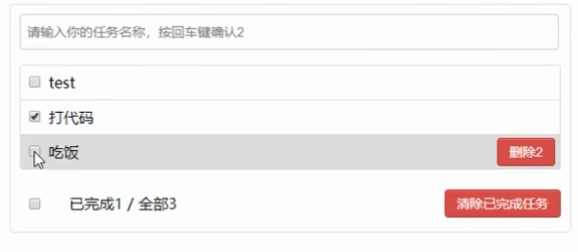

<a id="mulu">目录</a>
<a href="#mulu" class="back">回到目录</a>
<style>
    .back{width:40px;height:40px;display:inline-block;line-height:20px;font-size:20px;background-color:lightyellow;position: fixed;bottom:50px;right:50px;z-index:999;border:2px solid pink;opacity:0.3;transition:all 0.3s;color:green;}
    .back:hover{color:red;opacity:1}
    img{vertical-align:bottom;}
</style>

<!-- @import "[TOC]" {cmd="toc" depthFrom=3 depthTo=6 orderedList=false} -->

<!-- code_chunk_output -->

- [基础效果](#基础效果)
    - [初始化列表](#初始化列表)
    - [添加](#添加)
    - [勾选](#勾选)
    - [删除](#删除)
    - [底部](#底部)
    - [总结](#总结)
- [本地存储](#本地存储)

<!-- /code_chunk_output -->

<!-- 打开侧边预览：f1->Markdown Preview Enhanced: open...
只有打开侧边预览时保存才自动更新目录 -->

写在前面：此笔记来自b站课程[尚硅谷Vue2.0+Vue3.0全套教程](https://www.bilibili.com/video/BV1Zy4y1K7SH) / [资料下载](https://www.aliyundrive.com/s/B8sDe5u56BU/folder/61138e6e8582eecbe4c84546a1b2d58363d20bc0)

**组件化编码流程**：
- 实现静态组件：抽取组件，实现静态页面效果
  命名不要与HTML元素冲突
- 展示动态数据：数据的类型、名称、保存在哪个组件
  - 数据只有一个组件使用：放在该组件上即可
  - 多个组件都使用：放在他们共同的父组件上（状态提升）
- 交互：从绑定事件监听开始

### 基础效果
{:width=200 height=200}
- 输入任务名称，按回车后添加到下面
- 每个列表项都有删除按钮，点击后删除
- 每个列表项都有复选框（代表是否完成），底部有全选按钮
- 右下角清除选中的任务

组件划分：
- 最上面的输入框`TodoHeader`
- 中间的事项列表`TodoList`
  - 每个列表项`TodoItem`
- 下面的两个按钮`TodoFooter`

创建vue项目：`vue create todo-list`
- 之后在components中创建4个组件，将`资料\04_静态页面\1_todos_page`中的HTML和CSS拆分到每个组件中
##### 初始化列表
数据结构：一个数组，每个元素是一个对象，对应一个列表项，包括事项id、名称、是否完成
- 保存在`App`中，然后把这个数组通过props传个三个组件。如果保存`TodoList`中，后面要通过添加按钮/删除按钮修改该数据，就涉及同级组件间传递数据

```js
/* App.vue */
data() {
    return {
        todos:[
            {id:'001', title:"吃饭", done:true},
            {id:'002', title:"睡觉", done:false},
            {id:'003', title:"写作业", done:false},
        ]
    }
}
```
使用vfor遍历，并把数据传入`TodoItem`中
```html
<!-- TodoList.vue -->
<TodoItem v-for="todo in todos" :key="todo.id" :todo="todo"/>
<script>
    import TodoItem from './TodoItem.vue'
    export default {
        name:"TodoList",
        components:{TodoItem},
        props:['todos']
        
    }
</script>
<!-- TodoItem.vue -->
<label>
    <input type="checkbox" :checked="todo.done"/>
    <!-- 如果完成，就默认勾选 -->
    <span>{{todo.title}}</span>
</label>
<script>
    export default {
        name:"TodoItem",
        props:['todo'],
    }
</script>
```
##### 添加
给input加一个键盘事件
关键问题：如何确定新事项的id
- 使用`nanoid`包：`npm i nanoid`
- 可生成一个唯一的id

子组件`TodoHeader`修改父组件`App`中的数据：
- 父组件中定义一个修改数据的函数，然后将该函数通过props传给子组件，子组件调用该函数即可修改。简单来说，就是“数据在哪，操作数据的方法就写在哪”

```html
<!-- App.vue -->
<TodoHeader :addTodo="addTodo"/>
<script>
methods: {
    addTodo(todo){
        this.todos.unshift(todo); //添加到数组的最前面，让新事项展示在列表最上方
    }
},
</script>
<!-- TodoHeader.vue -->
<script>
    methods: {
        add(e){
            const input = e.target.value.trim();
            e.target.value = ''; //清空输入框
            if(!input) return alert("输入不能为空"); //不能添加空字符串
            const todo = { //要添加的todo
                id:nanoid(),
                title:input,
                done:false
            };
            this.addTodo(todo); //添加todo
        },
    }
</script>
```
注意：函数名`addTodo`不能与方法名`add`，否则传递时会覆盖
##### 勾选
**第一种方法：与上面的方法相同，都是通过传函数**
- 获取点击的li对应的id：item组件中`todo.id`就是对应的id

```html
<!-- App.vue -->
<TodoList :todos="todos" :checkTodo="checkTodo"/>
<script>
    methods: {
        checkTodo(id){ //勾选/取消勾选
            this.todos.forEach(todo=>{
                if(todo.id===id) todo.done = !todo.done;
            });
        }
    },
</script>
<!-- TodoList.vue -->
<TodoItem 
    v-for="todo in todos" 
    :key="todo.id" 
    :todo="todo" 
    :checkTodo="checkTodo"
/>
<!-- 添加props略，下同 -->
<!-- TodoItem.vue -->
<input type="checkbox" :checked="todo.done" @change="HandleCheck(todo.id)"/>
<script>
    methods: {
        HandleCheck(id){
            this.checkTodo(id)
        }
    },
</script>
```
**第二种方法：直接用vmodel绑定checked属性**
```html
<!-- TodoItem.vue -->
<input type="checkbox" v-model:checked="todo.done"/>
```
- 因为是双向数据绑定，能同时实现初始化和更改
- 但不建议这么写，因为todo是props从上级传来的，而props不建议修改
- 为什么控制台没警告：对于js的基本数据类型，修改它的值就是修改；而对于对象，必须修改地址（改为一个新对象）才算是修改，改属性值不能被监测到
##### 删除
实现思路同上
```html
<!-- App.vue -->
<TodoList :todos="todos" :checkTodo="checkTodo" :deleteTodo="deleteTodo"/>
<script>
    methods: {
        deleteTodo(id){
            this.todos = this.todos.filter(todo=>{
                return todo.id !== id;
            });
        }
    },
</script>
<!-- TodoList.vue -->
<TodoItem 
    v-for="todo in todos" 
    :key="todo.id" 
    :todo="todo" 
    :checkTodo="checkTodo"
    :deleteTodo="deleteTodo"
/>
<!-- 添加props略，下同 -->
<!-- TodoItem.vue -->
<button class="btn btn-danger" @click="HandleDelete(todo.id)">删除</button>
<script>
    methods: {
        HandleDelete(id){
            if(confirm("确定删除吗？")) this.deleteTodo(id);
        }
    },
</script>
```
##### 底部
**统计数量**：
- 全部的数量：直接`todos.length`即可
- 已完成的数量：使用计算属性，遍历todos

**全选框**：
- 初始时刻是否勾选（是否全部已完成），取决于全部的数量是否等于已完成的数量，使用计算属性`isAllDone`
- 点击全选框，就获取当前全选框的状态，然后使用传函数的方式改变todos的值
  - 可以绑定点击事件，在点击事件中调用函数
  - 也可以直接使用vmodel绑定checked属性，然后定义`isAllDone`的setter，如果改变就调用改变todos值的函数

**清空所有已完成**：App中定义一个函数，删掉所有done为true的todo就可以了，然后把这个函数传给footer
```html
<!-- App.vue -->
<TodoFooter :todos="todos" :checkAllTodo="checkAllTodo" :deleteAllDone="deleteAllDone"/>
<script>
    methods: {
        checkAllTodo(isCheck){ //全选按钮
            this.todos.forEach(todo=>{
                todo.done = isCheck;
            });
        },
        deleteAllDone(){ //删掉所有已完成
            this.todos = this.todos.filter(todo=>{
                return !todo.done;
            });
        }
    },
</script>
<!-- TodoFooter.vue -->
<div class="todo-footer" v-show="total"> <!-- 如果一项任务都没有，就不展示底部栏 -->
    <label>
        <!-- <input type="checkbox" :checked="isAllDone" @click="checkAll"/> -->
        <input type="checkbox" v-model="isAllDone"/>
    </label>
    <span>
        <span>已完成{{doneTotal}}</span> / 全部{{total}}
    </span>
    <button class="btn btn-danger" @click="handleDeleteAllDone">清除已完成任务</button>
</div>
<script>
    export default {
        name:"TodoFooter",
        props:['todos', 'checkAllTodo', 'deleteAllDone'],
        computed:{
            total(){
                return this.todos.length;
            }, 
            doneTotal(){
                /* let i =0;
                this.todos.forEach(todo => {
                    if(todo.done) i++;
                });
                return i; */
                return this.todos.reduce((prev, curr)=>prev+curr.done, 0); //精简写法
            },
            /* isAllDone(){ //一个计算属性可以通过其它计算属性计算得到
                if(this.total===0) return false; //如果总数为0就不勾选
                return this.total===this.doneTotal;
            }, */
            isAllDone:{
                get(){
                    return this.total===this.doneTotal&&this.total>0;
                },
                set(v){
                    this.checkAllTodo(v);
                }
            }
            
        },
        methods: {
            /* checkAll(e){
                this.checkAllTodo(e.target.checked);
            }, */
            handleDeleteAllDone(){
                this.deleteAllDone();
            }
        },
    }
</script>
```
##### 总结
**props适用于**：
- 父组件->子组件
- 子组件->父组件（此时要求父组件给子组件传函数）
  - 如果跨越多层，可以逐层传递

使用vmodel时要注意：vmodel绑定的值不能是props传来的值，因为这种值不能修改
props如果传的是对象类型，修改其中属性时Vue不报错，但不推荐这样做
### 本地存储
使用监视属性，每当todos改变时，就刷新本地存储
- 而不是在每次新增/删除时操作本地存储

```js
/* App.vue */
data() {
    return {
        todos:JSON.parse(localStorage.getItem('todos'))||[]
    }
},
watch:{
    todos:{
        deep:true, //必须开启深度监视，否则属性值变化监测不到
        handler(v){
            localStorage.setItem('todos', JSON.stringify(v));
        }
    }
}
```
