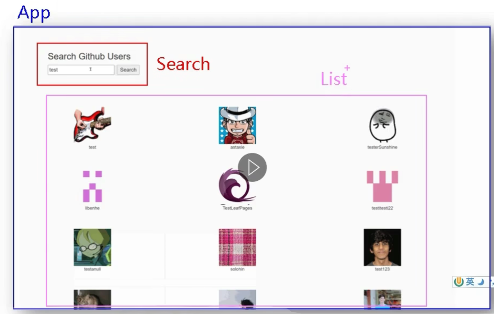
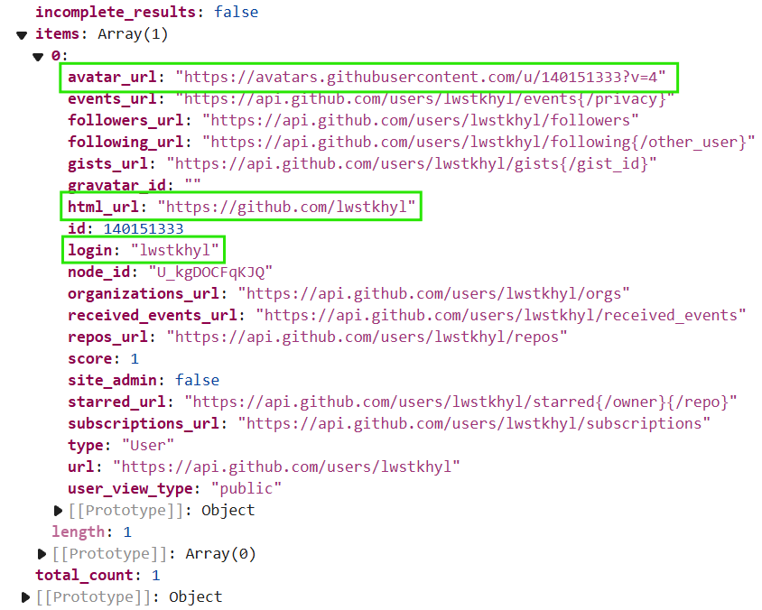

<a id="mulu">目录</a>
<a href="#mulu" class="back">回到目录</a>
<style>
    .back{width:40px;height:40px;display:inline-block;line-height:20px;font-size:20px;background-color:lightyellow;position: fixed;bottom:50px;right:50px;z-index:999;border:2px solid pink;opacity:0.3;transition:all 0.3s;color:green;}
    .back:hover{color:red;opacity:1}
    img{vertical-align:bottom;}
</style>

<!-- @import "[TOC]" {cmd="toc" depthFrom=3 depthTo=6 orderedList=false} -->

<!-- code_chunk_output -->

- [静态页面](#静态页面)
- [动态组件](#动态组件)
- [优化](#优化)

<!-- /code_chunk_output -->

<!-- 打开侧边预览：f1->Markdown Preview Enhanced: open...
只有打开侧边预览时保存才自动更新目录 -->

写在前面：此笔记来自b站课程[尚硅谷Vue2.0+Vue3.0全套教程](https://www.bilibili.com/video/BV1Zy4y1K7SH) / [资料下载](https://www.aliyundrive.com/s/B8sDe5u56BU/folder/61138e6e8582eecbe4c84546a1b2d58363d20bc0)

效果：输入关键词，下面显示搜索结果
{:width=400 height=400}
### 静态页面
**引入外部公用CSS文件**：
- 在`/src/assets`文件夹中，创建一个`css`文件夹，之后在`App.vue`中引入
    ```js
    import './assets/css/bootstrap.css'
    ```
    这种方式要求很严格：如果CSS引用了不存在的路径就报错
- 在`public`文件夹中，创建一个`css`文件夹，之后在`index.html`中引入
    ```html
    <link rel="stylesheet" href="<%= BASE_URL %>css/bootstrap.css">
    ```

**拆分组件**：顶部的搜索框`MySearch`和结果展示区域`MyList`
```html
<!-- App.vue -->
<template>
	<div class="container">
		<MySearch/>
		<MyList/>
	</div>
</template>
<!-- MySearch.vue -->
<template>
	<section class="jumbotron">
		<h3 class="jumbotron-heading">Search Github Users</h3>
		<div>
			<input type="text" placeholder="enter the name you search"/>&nbsp;<button>Search</button>
		</div>
	</section>
</template>
<!-- MyList.vue -->
<template>
    <div class="row">
        <div class="card">
            <a href="xxx" target="_blank">
                
            </a>
            <p class="card-text">xxx</p>
        </div>
    </div>
</template>
```
### 动态组件
数据是在List中展示，所以数据就保存在List中
如何获取数据：使用GitHub官方接口：`https://api.github.com/search/users?q=xxx`
- 先使用vmodel获取输入
- 然后给搜索按钮绑定事件，发送Ajax请求
- 使用全局事件总线把数据给List

获取到的数据`value.data.items`：
{:width=500 height=500}
- `avatar_url`：用户头像
- `html_url`：用户主页
- `login`：用户名
- `id`：用户id（作为vfor遍历生成列表的key）

```html
<!-- MySearch.vue -->
<input type="text" placeholder="enter the name you search" v-model="keyWord"/>&nbsp;
<button @click="getUsers">Search</button>
<script>
import axios from 'axios'
export default {
	name: 'MySearch',
	data() {
		return {
			keyWord: ''
		}
	},
	methods: {
		getUsers(){
			if(!this.keyWord.trim()) {
				this.keyWord = '';
				return alert("输入不能为空");
			}
			axios.get(`https://api.github.com/search/users?q=${this.keyWord}`)
				.then(value => {
					this.$bus.$emit('getUsers', value.data.items)
				}, reason => {
					alert('请求发送失败');
					console.log("发送失败，原因是" + reason);
				});
		}
	},
}
</script>
<!-- MyList.vue -->
<div class="card" v-for="user in users" :key="user.id">
    <a :href="user.html_url" target="_blank">
        
    </a>
    <p class="card-text">{{user.login}}</p>
</div>
<script>
export default {
    name: 'MyList',
    data() {
        return {
            users:[]
        }
    },
    mounted() {
        this.$bus.$on('getUsers', (data)=>{
            this.users = data.map(user => {
                return { //提取需要的变量
                    login: user.login,
                    avatar_url: user.avatar_url,
                    html_url: user.html_url,
                    id: user.id
                };
            }); //将数据保存到变量中
        });
    },
}
</script>
```
### 优化
- 未输入关键词时，List展示一些欢迎词
- 点击按钮发送请求，但还没得到响应时，List显示加载中

总的来说，List应有4种状态
- 没点按钮：welcome
- 点击按钮、没得到响应：loading
- 响应成功：users
- 响应失败：error

思路：
- 再设置3个变量：`isFirst`、`isLoading`、`errMsg`，根据这3个变量决定标签显示隐藏
- 什么时候改变这些变量
  - 初始：`isFirst = true`、`isLoading = false`
  - 点击按钮：`isFirst = false`、`isLoading = true`
  - 收到响应(`.then`)
    - 成功：`isLoading = false`、`users = value`
    - 失败：`isLoading = false`、`errMsg = reason`
- 方法：不用为每个变量都设置一个回调函数，直接在`getUsers`信号中把这3个变量随着`users`一起传即可
  具体来说，把它们封装到一个对象中存储到data中，之后在发送信号时也封装成一个对象传递（哪个变量发生改变，就传哪个变量，没改的不用传），然后收到信号用解构赋值更改传入的变量
    ```js
    data = {...data, ...newData}
    ```

```js
/* MySearch.vue */
getUsers(){
    if(!this.keyWord.trim()) {
        this.keyWord = '';
        return alert("输入不能为空");
    }
    this.$bus.$emit('getUsers', {isFirst: false, isLoading: true, users: [], errMsg: ''}); //发送请求、未得到数据（data设为空是为了清空上一次的搜索数据）
    axios.get(`https://api.github.com/search/users?q=${this.keyWord}`)
        .then(value => {
            const res = value.data.items.map(user => {
                return { //提取需要的变量
                    login: user.login,
                    avatar_url: user.avatar_url,
                    html_url: user.html_url,
                    id: user.id
                };
            }); //将数据保存到变量中
            if(res.length === 0){ //查询没有结果
                return this.$bus.$emit('getUsers', {isLoading: false, users: [], errMsg: '未查询到符合条件的结果'});
            }
            this.$bus.$emit('getUsers', {isLoading: false, users: res, errMsg: ''}); //发送请求、响应成功
        }, reason => {
            this.$bus.$emit('getUsers', {isLoading: false, errMsg: reason.message, users: []}); //发送请求、响应错误
        });
}
```
```html
<!-- MyList.vue -->
<div class="row">
    <!-- 用户列表 -->
    <div v-show="info.users.length" class="card" v-for="user in info.users" :key="user.id">
        <a :href="user.html_url" target="_blank">
            
        </a>
        <p class="card-text">{{user.login}}</p>
    </div>
    <!-- 欢迎词 -->
    <h1 v-show="info.isFirst">Welcome!</h1>
    <!-- 加载中 -->
    <h1 v-show="info.isLoading">Loading...</h1>
    <!-- 出错 -->
    <h1 v-show="info.errMsg">{{info.errMsg}}</h1>
</div>
<script>
export default {
    data() {
        return {
            info:{
                users:[],
                isFirst: true,
                isLoading: false,
                errMsg: ''
            }
        }
    },
    mounted() {
        this.$bus.$on('getUsers', (dataObj) => {
            this.info = {...this.info, ...dataObj};
        });
    },
}
</script>
```
